# PCa mHealth: how it was built, and how to run it yourself

This manual explains every part of the system (the backend, the databases, Docker, the AI service, the chatbot, the phone app and the admin website): how each was made, and how to start, stop, check, change and repair it **without an AI assistant**.

- **Who it is for:** the project owner, and anyone who takes the project over.
- **What you need to know already:** how to open PowerShell and how to open a file in an editor. Everything else is written out.
- **Where commands are run:** in PowerShell, from the project folder `D:\Final Year Project\pca-mhealth`, unless a step says otherwise.
- **The pictures are made from the project itself** (section 17). The code pictures show the real files, each with its file name and line numbers, so you can open the same place yourself; the cover of the PDF says from which commit they were taken. The terminal pictures show the real output of the commands. The phone and admin pictures use synthetic data.
- **All data is synthetic.** The system is a research prototype, not a medical device.

**Contents**

1. [The system on one page](#1-the-system-on-one-page)
2. [What is installed on this PC](#2-what-is-installed-on-this-pc)
3. [Starting and stopping](#3-starting-and-stopping)
4. [The settings file (.env)](#4-the-settings-file-env)
5. [The backend](#5-the-backend)
6. [The databases](#6-the-databases)
7. [Docker](#7-docker)
8. [The AI service](#8-the-ai-service)
9. [The chatbot, end to end](#9-the-chatbot-end-to-end)
10. [The phone app](#10-the-phone-app)
11. [The admin website](#11-the-admin-website)
12. [Tests and the quality gate](#12-tests-and-the-quality-gate)
13. [Git and GitHub](#13-git-and-github)
14. [When something goes wrong](#14-when-something-goes-wrong)
15. [Before real patients](#15-before-real-patients)
16. [Where to read more](#16-where-to-read-more)
17. [Updating this manual](#17-updating-this-manual)

---

## 1. The system on one page

PCa mHealth helps clinics in Zambia screen for prostate cancer. Clinicians register patients and record screenings on a phone, also without internet. Pathologists review slides. Patients see their own results, read or listen to health information, and ask an assistant questions. Administrators manage accounts on a website.

**The pieces**

| Piece | What it does | Built with | Folder | Address on this PC |
|---|---|---|---|---|
| Phone app | Screens for patients, clinicians and pathologists; works offline | Flutter 3.35 (Dart) | `1-presentation-layer/mobile-app` | runs on the emulator or a phone |
| Admin website | Accounts, roles, patient links, audit log, dashboard | React 19 + Vite 8 (TypeScript) | `1-presentation-layer/admin-panel-web` | http://localhost:5173 |
| Backend (the API) | Every rule of the system: sign-in, permissions, patients, consent, uploads, sync, chat, audit | NestJS 11 (TypeScript) on Node 24 | `3-application-logic/backend` | http://localhost:3000 |
| AI service | The AI models (labelled mock models for now) and the chatbot's search | FastAPI (Python 3.14) | `4-ai-intelligence-layer/ai-services` | http://127.0.0.1:8000 |
| PostgreSQL | Accounts, patients, screenings, consents, audit log | PostgreSQL 18, installed on the PC | schema in `3-application-logic/backend/prisma`, history in `5-data-persistence/postgresql/migrations` | localhost:5432 |
| MongoDB | AI reports, chats, scan details | MongoDB 8.3, installed on the PC | `3-application-logic/backend/src/persistence/mongo` | localhost:27017 |
| Redis, MinIO, Qdrant | Shared rate limits; S3 file storage; vector search (planned) | Docker containers | `6-infrastructure/docker` | 6379; 9000 and 9001; 6333 |

**How a request travels**

```
Phone app / admin website
        |   HTTPS in production; http://localhost:3000 on this PC
        v
Backend (NestJS)
  1. rate limit per network address
  2. who are you?  (JWT access token)
  3. rate limit per account
  4. may you do this?  (role permissions)
  5. is the request well-formed?  (validation)
  6. the service does the work and writes an audit entry
        |                    |                     |
        v                    v                     v
  PostgreSQL 18         MongoDB 8.3          AI service (FastAPI)
  (records)             (documents)          (models, chatbot search)
```

The phone app never talks to a database or to the AI service. Everything goes through the backend, so every rule is enforced in one place.

**Why these choices** (each has a decision record in `docs/decisions/`):
- Flutter, because one codebase gives Android and iPhone apps with good offline support (ADR-001).
- NestJS with PostgreSQL and MongoDB, and a separate Python service for AI, because AI libraries live in Python while the rest benefits from TypeScript's type checks (ADR-003).
- A website for administrators instead of phone screens, because administration is desk work (ADR-005).
- A chatbot that only answers from reviewed documents, because a health assistant must never invent medical text (ADR-009, ADR-010).

## 2. What is installed on this PC

Checked on 30 September 2026:

| Tool | Version | Used for | How to check |
|---|---|---|---|
| Node.js / npm | 24.15.0 / 11.12.1 | backend, admin website, scripts | `node -v` |
| Python | 3.14.5 | AI service | `python --version` |
| Flutter / Dart SDK | 3.35.2 / 3.9 | phone app | `flutter --version` |
| Android Studio + SDK | emulator `Galaxy_S9_Plus_API_29` | running the app | Android Studio › Device Manager |
| PostgreSQL | 18.6 (service `postgresql-x64-18`), with pgAdmin 4 | main database | `& "C:\Program Files\PostgreSQL\18\bin\psql.exe" --version` |
| MongoDB | 8.3.2 (service `MongoDB`), with Compass | document database | Services (`services.msc`) |
| Docker Desktop | 29.8.0 | Redis, MinIO, Qdrant | `docker --version` |
| Git | 2.51 | version control | `git --version` |
| Google Chrome | | admin website | |

On a new PC, install the same tools, then follow [section 3.5](#35-setting-up-on-a-new-pc).

## 3. Starting and stopping

### 3.1 Start everything with one command

```powershell
cd "D:\Final Year Project\pca-mhealth"
powershell -ExecutionPolicy Bypass -File 6-infrastructure\scripts\dev-up.ps1
```

The script does this, in order:

1. Checks that the `.env` settings file exists.
2. Checks that the two database services (**postgresql-x64-18** and **MongoDB**) are running, and starts them if not.
3. Starts Docker Desktop if needed, then Redis, MinIO and Qdrant.
4. Stops an old backend if one is still running.
5. Applies any new database changes (`prisma migrate deploy`) and makes sure the synthetic demo data exists (`db:seed`).
6. Builds the backend and starts it in its own window.
7. Waits until the backend answers.
8. Starts the admin website in its own window.
9. Starts the AI service in its own window.

**Keep the three windows open.** Closing a window stops that piece.

This is the part of the script that looks after the databases:

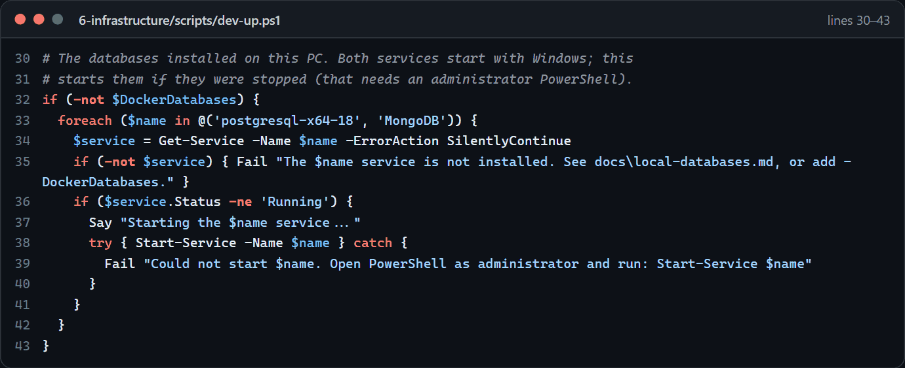

### 3.2 Check that everything is up

| Open this | You should see |
|---|---|
| http://localhost:3000/api/v1/health | `"status":"ok"` |
| http://127.0.0.1:8000/v1/health | `"status":"ok"`, and `chat_writer` says `quotes` (or `claude:…` when Claude is switched on) |
| http://localhost:5173 | the admin sign-in page |
| http://localhost:3000/api/docs | the API explorer, listing every route |

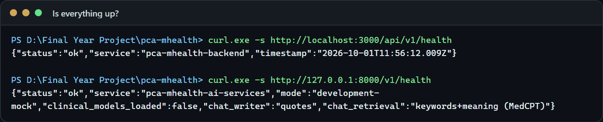

### 3.3 Stop everything

```powershell
powershell -ExecutionPolicy Bypass -File 6-infrastructure\scripts\dev-down.ps1
```

It stops the backend, the admin website, the AI service and the Docker containers. **No data is lost.** PostgreSQL and MongoDB keep running as Windows services, which is normal.

### 3.4 Start each piece by hand

Use this when you want to see one piece's messages, or when the script fails.

**Databases** (usually already running):
```powershell
Get-Service postgresql-x64-18, MongoDB          # both should say Running
Start-Service postgresql-x64-18                 # needs PowerShell "Run as administrator"
Start-Service MongoDB
```

**Docker services:**
```powershell
docker compose -f 6-infrastructure\docker\docker-compose.yml --env-file .env up -d
```

**Backend:**
```powershell
cd 3-application-logic\backend
npm ci                      # only the first time, or after package.json changed
npx prisma migrate deploy   # apply database changes
npm run db:seed             # synthetic demo data (safe to repeat)
npm run build
npm run start:prod          # or: npm run start:dev  (restarts when you save a file)
```

**AI service:**
```powershell
cd 4-ai-intelligence-layer\ai-services
py -3 -m venv .venv                                  # only the first time
.venv\Scripts\python -m pip install -e ".[dev]"      # only the first time
.venv\Scripts\python -m uvicorn app.main:app --host 127.0.0.1 --port 8000
```

**Admin website:**
```powershell
cd 1-presentation-layer\admin-panel-web
npm ci          # only the first time
npm run dev     # then open http://localhost:5173
```

**Phone app:** see [section 10.2](#102-running-the-app).

### 3.5 Setting up on a new PC

1. Install the tools in section 2.
2. Get the code: `git clone https://github.com/deedeestephen/final-year-project.git`
3. Create the settings file with fresh random secrets: `node 6-infrastructure\scripts\gen-keys.mjs --init-env`
4. Create the database login and database: follow steps 1 and 3 of [local-databases.md](local-databases.md#how-the-databases-were-set-up-2026-09-29), and put the same passwords in `.env`.
5. Install the AI service (the two "only the first time" lines above).
6. Run `dev-up.ps1`. It installs the other packages, creates the tables and adds the demo data.

### 3.6 Signing in

The seed creates four synthetic demo accounts:

| Account | Role | Where it signs in |
|---|---|---|
| `admin@demo.pca-mhealth.test` | Administrator | admin website |
| `clinician@demo.pca-mhealth.test` | Clinician | phone app |
| `pathologist@demo.pca-mhealth.test` | Pathologist | phone app |
| `patient@demo.pca-mhealth.test` | Patient | phone app |

- **The password** of all four is the value of `SEED_DEMO_PASSWORD` in `.env`.
- The first time an account signs in, it may be asked to choose its own password (12 or more characters).
- **Forgot it, or locked out?** Five wrong tries lock an account for 15 minutes. This command puts all four back to the password in `.env` and removes the lock:

```powershell
powershell -ExecutionPolicy Bypass -File 6-infrastructure\scripts\dev-up.ps1 -ResetDemoPasswords
```

## 4. The settings file (.env)

`.env` sits in the project folder. It holds every setting and every secret: database passwords, the keys that sign sessions, the key that encrypts personal fields.

- **It is never committed to Git.** `.gitignore` excludes it, and a secret scanner checks every commit.
- **`.env.example` is not the settings file.** It is a template with empty or placeholder values, which *is* in Git, so a new developer knows which settings exist.
- **How it was made:** `node 6-infrastructure\scripts\gen-keys.mjs --init-env` copies the template and fills every secret with random values.
- **After changing `.env`, restart the piece that reads it** (the backend or the AI service).
- **A value that contains `$` must be in single quotes**, for example `SEED_DEMO_PASSWORD='$example'`. Otherwise Docker reads `$example` as a variable and prints a warning.

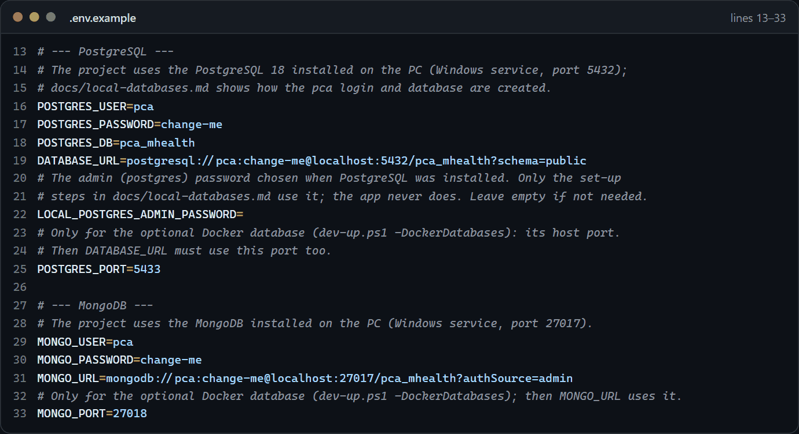

**The settings in groups**

| Group | Settings | Meaning |
|---|---|---|
| Backend | `PORT`, `CORS_ORIGINS`, `RATE_LIMIT_MAX`, `USER_RATE_LIMIT_MAX` | port 3000; which website may call the API; 600 requests a minute per address, 120 per account |
| PostgreSQL | `DATABASE_URL`, `POSTGRES_USER`, `POSTGRES_PASSWORD`, `LOCAL_POSTGRES_ADMIN_PASSWORD` | where the main database is; the app's login; the admin login, used only for set-up |
| MongoDB | `MONGO_URL`, `MONGO_USER`, `MONGO_PASSWORD` | where the document database is |
| Redis | `REDIS_URL`, `REDIS_PASSWORD` | shared rate-limit counters; without it each backend counts alone |
| Files | `STORAGE_DRIVER`, `LOCAL_STORAGE_ROOT`, `S3_*`, `MINIO_*` | `local` (now): files go to `backend/var/objects`; `s3`: files go to MinIO |
| Sign-in | `JWT_PRIVATE_KEY_BASE64`, `JWT_PUBLIC_KEY_BASE64` | the key pair that signs sessions |
| Encryption | `FIELD_ENCRYPTION_KEY_BASE64`, `FIELD_HMAC_KEY_BASE64` | encrypt names, phone and NRC numbers. **If these are lost, those fields cannot be read again: back up `.env` safely** |
| AI | `AI_SERVICE_URL`, `AI_SERVICE_TOKEN`, `ANTHROPIC_API_KEY`, `CHAT_LLM_MODEL`, `CHAT_LLM_DAILY_LIMIT` | where the AI service is; the shared token; Claude is off while the key is empty |
| Demo | `SEED_DEMO_PASSWORD` | the password of the four demo accounts |

## 5. The backend

### 5.1 What it is and how it is organised

The backend is a NestJS application: a web server that answers requests under `http://localhost:3000/api/v1/…`. Its source is in `3-application-logic/backend/src`, in three folders that match the architecture:

| Folder | What is inside |
|---|---|
| `gateway/` | What every request passes through: sign-in check, permissions, rate limits, validation, error format, logging, upload checks |
| `services/` | One folder per feature: `auth`, `users`, `patients`, `clinical`, `imaging`, `ai`, `chatbot`, `sync`, `notifications`, `fhir`, `admin`, `audit` |
| `persistence/` | Talking to stores: `database` (PostgreSQL through Prisma, and MongoDB), `storage` (files), `crypto` (field encryption), `mongo` (collection rules), `seed.ts` (demo data) |

Each feature folder has the same three kinds of file:
- a **controller** (`*.controller.ts`): the routes, and the permission each one needs;
- a **service** (`*.service.ts`): the rules and the database work;
- a **DTO** file (`*.dto.ts`): the exact shape of what may be sent and what comes back.

### 5.2 How it starts

`main.ts` is the first file that runs. It reads `.env`, builds the application, applies the security settings and starts listening on the port.

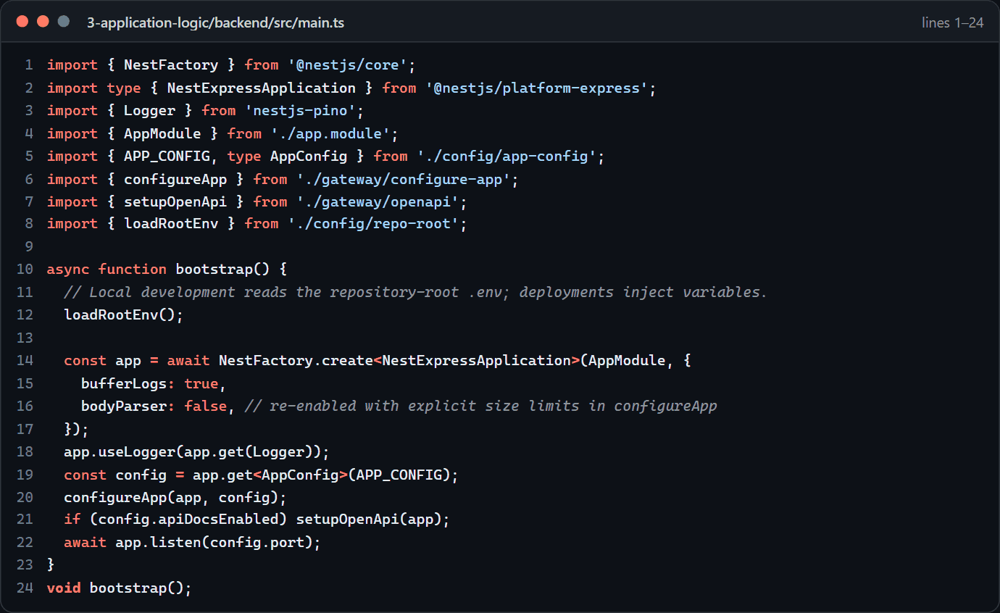

### 5.3 Four guards on every request

`app.module.ts` registers four guards that run on **every** route, in this order. A route is closed unless the code says otherwise ("deny by default").

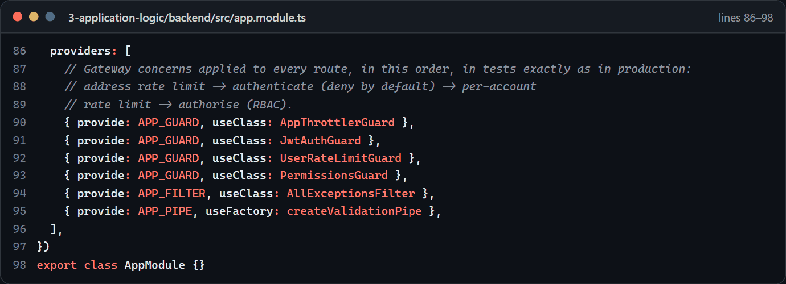

1. **AppThrottlerGuard:** at most 600 requests a minute from one network address.
2. **JwtAuthGuard:** the request must carry a valid session token. Only routes marked `@Public()` (sign-in, health) skip this.
3. **UserRateLimitGuard:** at most 120 requests a minute per account.
4. **PermissionsGuard:** the account's roles must include the permission the route asks for.

The permissions guard compares what the route needs with what the user has, and writes an audit entry when it refuses:


- **Roles:** `PATIENT`, `CLINICIAN`, `PATHOLOGIST`, `ADMIN`.
- **Permissions** are codes such as `patient:read` or `user:manage`. Roles hold permissions, and users hold roles.
- **Every route and who may use it** is listed in [access-matrix.md](access-matrix.md) (73 routes). That file is generated from the code with `npm run access:matrix`, and the quality gate fails if it is out of date.

### 5.4 One feature from top to bottom: deleting an account

The **route** says which address it answers, which permission it needs, and what it returns:

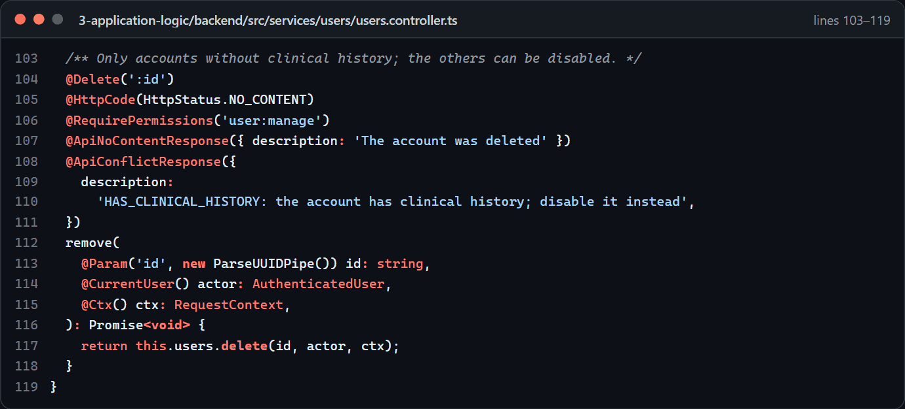

The **service** holds the rules. It refuses the administrator's own account and any account named in the clinical record. Otherwise it deletes the account and writes the audit entry in one database transaction (both happen or neither does). Last, it removes the account's chats from MongoDB.

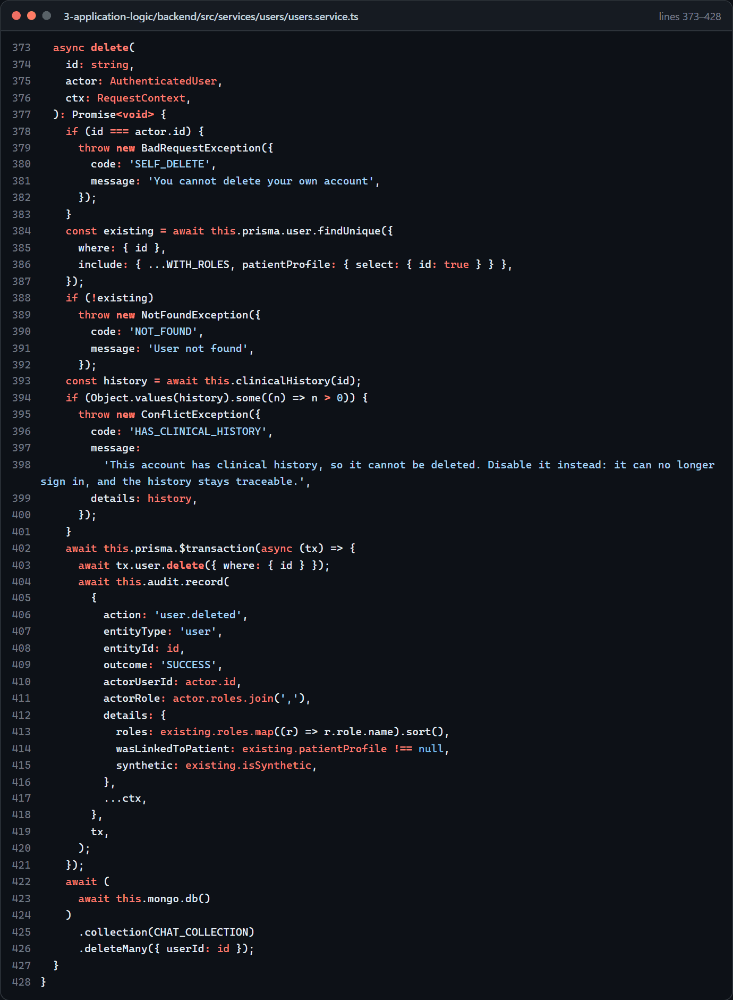

Every feature follows this pattern: controller → service → Prisma (database) → audit.

### 5.5 Security that is built in

| Protection | How |
|---|---|
| Passwords | Stored only as Argon2id hashes (64 MB memory, 3 passes). Nobody, including an administrator, can read a password. At least 12 characters |
| Sessions | A short access token (15 minutes), signed with an Ed25519 key pair, plus a refresh token (14 days) that is replaced on every use. A stolen, reused refresh token ends the whole session family |
| Lockout | 5 wrong passwords lock the account for 15 minutes |
| Personal fields | Names, phone and NRC numbers are encrypted in the database (AES-256-GCM). The NRC can still be matched exactly through a keyed hash |
| Audit log | Every important action is recorded. The table only accepts new rows, and each row carries a hash of the row before it, so any later change is detected |
| Input | Every request body is validated against its DTO; unknown fields are rejected |
| Uploads | Size limits, file-type checks by content, DICOM header checks |

The audit chain is enforced by the database itself, not only by the application:


On the admin website, **Audit log › Check integrity** re-computes the whole chain.

### 5.6 Backend commands

Run these in `3-application-logic\backend`:

| Task | Command |
|---|---|
| Install packages | `npm ci` |
| Build | `npm run build` |
| Start (built code) | `npm run start:prod` |
| Start and restart on every save | `npm run start:dev` |
| Unit tests | `npm test` |
| End-to-end tests (no database needed) | `npm run test:e2e` |
| Database tests (need PostgreSQL, MongoDB and Docker's MinIO) | `npm run test:db` |
| Whole workflows on the live system | `npm run test:workflows` |
| Format and lint | `npx prettier --write src test` and `npm run lint` |
| Rebuild the API description | `npm run openapi:export` |
| Rebuild the route list | `npm run access:matrix` |
| Reset the demo passwords | `npm run db:reset-demo` |

### 5.7 The API explorer

http://localhost:3000/api/docs lists every route with its inputs and outputs. To try one: sign in through `POST /api/v1/auth/login`, copy the `accessToken`, click **Authorize** and paste it. The same description is saved in `2-api-gateway/openapi/openapi.json`.

### 5.8 Adding a new route

1. Pick the feature folder in `src/services/` (or create one with a module, controller and service).
2. Describe the input and output in the `*.dto.ts` file.
3. Add the method to the service. Record an audit entry for anything that changes data.
4. Add the route to the controller with `@RequirePermissions('…')`.
5. Write a test: a unit test next to the file (`*.spec.ts`), or a database test in `test/db/`.
6. Run `npm run openapi:export` and `npm run access:matrix`.
7. Run the gate: `powershell -ExecutionPolicy Bypass -File 6-infrastructure\scripts\quality-gate.ps1 backend`.

## 6. The databases

### 6.1 What is stored where

| Data | Where | Why there |
|---|---|---|
| Accounts, roles, patients, screenings, consents, scans and slides (the records), AI jobs, notifications, sync history, audit log | PostgreSQL 18, database `pca_mhealth`, 20 tables | Structured records with strict rules and links between them |
| AI reports, AI logs, scan technical details, chatbot conversations | MongoDB 8.3, database `pca_mhealth`, 4 collections | Documents whose shape varies |
| Uploaded scan and slide files | the folder `3-application-logic/backend/var/objects` | Large files do not belong in a database |
| Rate-limit counters | Redis (Docker) | Fast, shared, temporary |

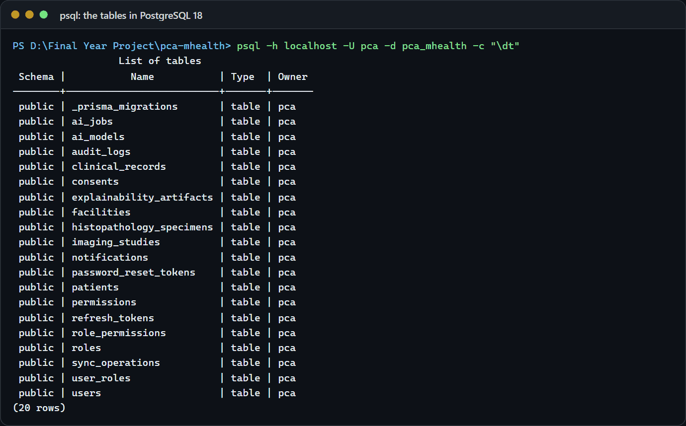

### 6.2 PostgreSQL: how the tables were made

The tables are **not** created by hand. They are described in one file, `3-application-logic/backend/prisma/schema.prisma`. This is the part that describes a user account:

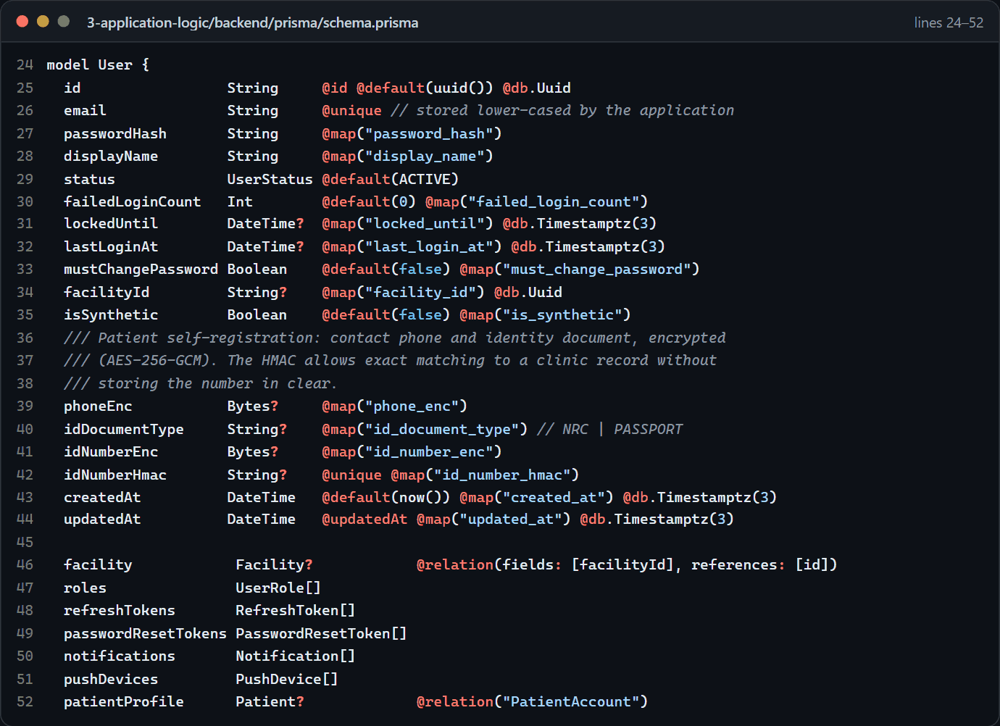

From that file, the tool **Prisma** generates:
- **migrations:** SQL files in `5-data-persistence/postgresql/migrations/`, one folder per change, in date order. They are the history of the database, and they are in Git.
- **the Prisma client:** the typed code the backend uses to read and write (`this.prisma.user.findUnique(…)`).

**To change the database:**

1. Edit `schema.prisma`.
2. Create the migration and apply it to your database:
   ```powershell
   cd 3-application-logic\backend
   npm run db:migrate:dev -- --name describe_the_change
   ```
3. Read the new SQL file in the migrations folder. Special rules (such as the audit triggers) are written into it by hand.
4. Commit the schema and the migration together.

**To apply existing migrations** (done by `dev-up.ps1`): `npx prisma migrate deploy`. It only ever adds what is missing.

**To check:**

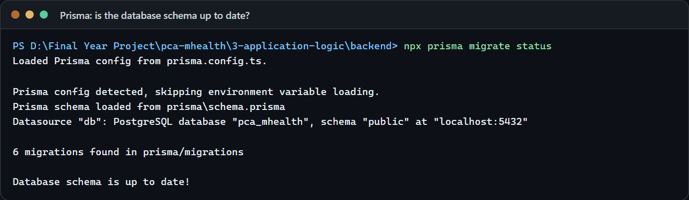

> **Never run `prisma migrate reset`.** It deletes every table and all data.

### 6.3 MongoDB: collections with rules

MongoDB would accept anything, so each collection has a validator: a rule the server checks on every write. They are defined in `src/persistence/mongo/collections.ts` and applied with:

```powershell
npm run db:mongo:migrate
```

| Collection | Holds |
|---|---|
| `ai_reports` | the result of each AI analysis, with its "MOCK" or "RESEARCH_MODEL" label |
| `ai_inference_logs` | a technical log of each model run |
| `imaging_metadata` | technical fields of uploaded scans (never the patient's name) |
| `chatbot_conversations` | chats; deleted automatically 180 days after the last message |

### 6.4 Looking at the data

- **PostgreSQL:** open **pgAdmin 4** › Servers › PostgreSQL 18 › Databases › `pca_mhealth` › Schemas › public › Tables. Right-click a table › View/Edit Data › All Rows.
- **MongoDB:** open **MongoDB Compass**, connect to `mongodb://localhost:27017`, open `pca_mhealth`.

Reading is always safe. **Do not add, change or delete rows by hand:**
- A typed-in account cannot sign in, because passwords are stored as hashes and some fields are encrypted.
- A hand-deleted row breaks links between records.
- A hand-edited audit log fails its integrity check.

Use the admin website or the API instead. The full guide is [local-databases.md](local-databases.md).

### 6.5 Backups

```powershell
# PostgreSQL: one file
& "C:\Program Files\PostgreSQL\18\bin\pg_dump.exe" -h localhost -U pca -d pca_mhealth -Fc -f D:\backups\pca_mhealth.dump

# Restore into an empty database
& "C:\Program Files\PostgreSQL\18\bin\pg_restore.exe" -h localhost -U pca -d pca_mhealth --no-owner --no-privileges D:\backups\pca_mhealth.dump
```

- **MongoDB:** copy it to another server or database name with the project's tool (below), or install the free *MongoDB Database Tools* for `mongodump` and `mongorestore`.
- **Files:** copy the folder `3-application-logic/backend/var/objects`.
- **`.env`:** keep a copy somewhere safe. Without its encryption keys, the encrypted fields in a backup cannot be read.

The copy tool walks through every collection and copies its rules, its indexes and its documents:

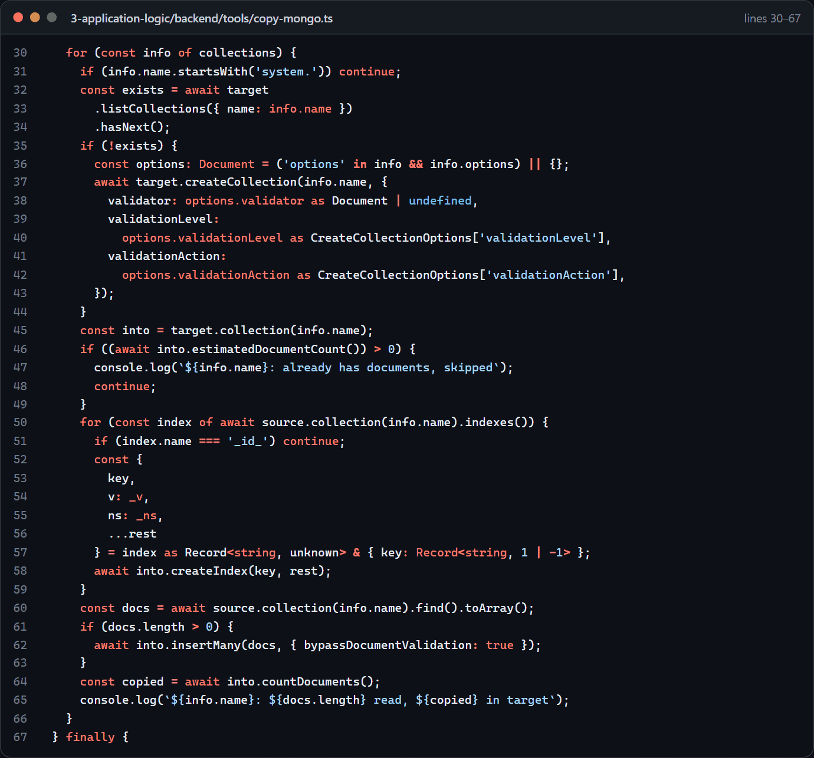

### 6.6 How the databases were moved onto this PC

Until 29 September 2026 PostgreSQL and MongoDB ran inside Docker. They were moved to the servers installed on the PC in six steps: create the login and database, dump and restore PostgreSQL, create the MongoDB login, copy the collections, change two lines in `.env`, and switch the Docker copies off. Every table had the same number of rows afterwards, and the audit chain still verified. The exact commands, and how to switch back, are in [local-databases.md](local-databases.md).

## 7. Docker

Docker runs a program in a sealed box called a **container**, with its data in a **volume** that survives restarts. This project uses Docker only for helper services, so nothing has to be installed for them.

`6-infrastructure/docker/docker-compose.yml` lists the containers:

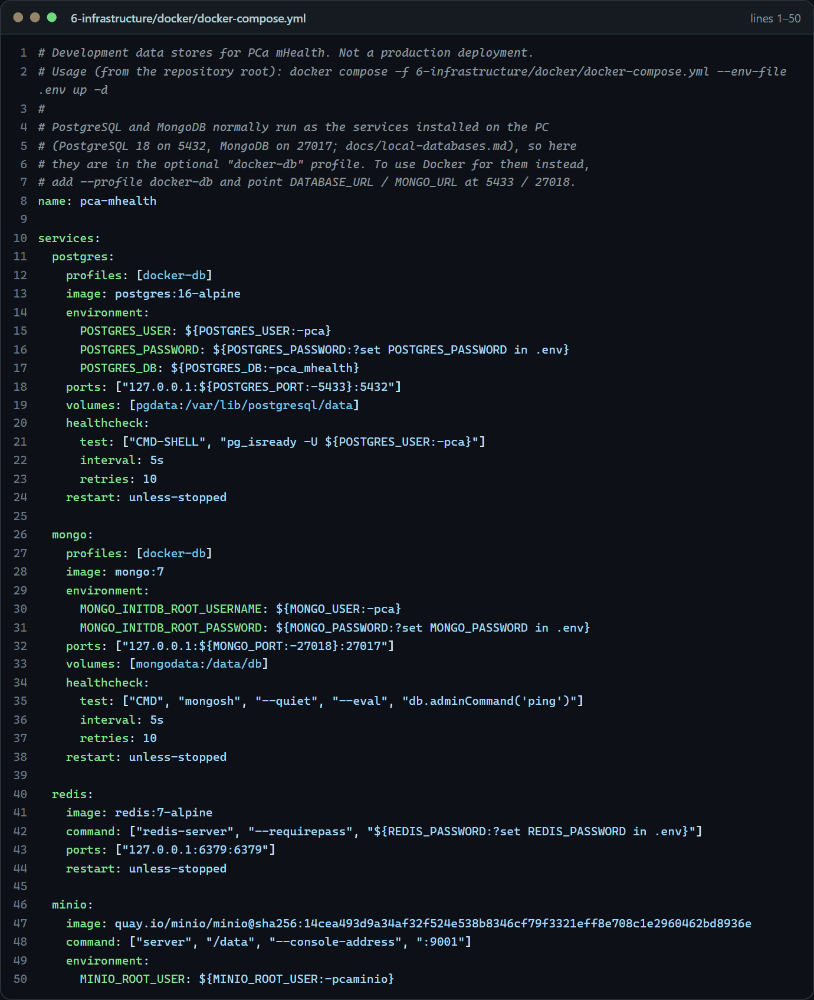

| Service | What it is | Port | Used now? |
|---|---|---|---|
| `redis` | fast counters for rate limits | 6379 | yes |
| `minio` | S3-style file storage, with a web console on 9001 | 9000, 9001 | by the database tests; by the app only when `STORAGE_DRIVER=s3` |
| `qdrant` | vector search | 6333 | not yet (`VECTOR_STORE=memory`) |
| `postgres`, `mongo` | the old Docker databases, kept as a backup | 5433, 27018 | no: they are in the optional `docker-db` profile and stay off |

**Commands** (Docker Desktop must be running; wait for "Engine running"):

```powershell
$compose = "6-infrastructure\docker\docker-compose.yml"

docker compose -f $compose --env-file .env up -d        # start
docker compose -f $compose --env-file .env ps           # what is running
docker compose -f $compose --env-file .env logs redis   # one service's messages
docker compose -f $compose --env-file .env restart minio
docker compose -f $compose --env-file .env stop         # stop, keep the data
```

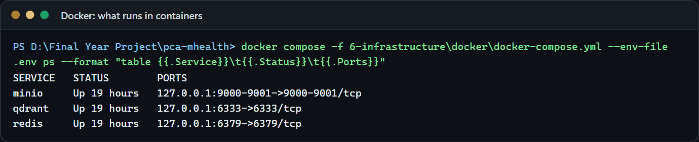

- **`stop` keeps everything.** `down` removes the containers but keeps the volumes. **`down -v` deletes the volumes and their data: do not use it** unless you mean to.
- **To use the Docker databases again:** set the ports in `DATABASE_URL` and `MONGO_URL` to 5433 and 27018, then run `dev-up.ps1 -DockerDatabases`.
- **A password change** for Redis or MinIO needs the container recreated: `docker compose -f $compose --env-file .env up -d --force-recreate redis minio`.

## 8. The AI service

A separate Python program (FastAPI) in `4-ai-intelligence-layer/ai-services`. Only the backend may call it, with the shared `AI_SERVICE_TOKEN`.

| Route | What it does |
|---|---|
| `GET /v1/health` | says it is up, that the models are **development mocks**, and whether Claude writes chat answers |
| `GET /v1/models` | the list of models and their versions |
| `POST /v1/infer` | runs an analysis (MRI, slide, risk score) |
| `POST /v1/chat/answer` | finds the reviewed passages for a question and returns the answer |

**The models are mocks.** No trained model exists yet, so the service returns labelled development data (*"DEVELOPMENT MOCK DATA — NOT A CLINICAL RESULT"*), and the app shows that label. When real models are trained, only this service changes: see [ai-model-integration-guide.md](ai-model-integration-guide.md).

**Commands** (in `4-ai-intelligence-layer\ai-services`):

| Task | Command |
|---|---|
| Install (first time) | `py -3 -m venv .venv` then `.venv\Scripts\python -m pip install -e ".[dev]"` |
| Run | `.venv\Scripts\python -m uvicorn app.main:app --host 127.0.0.1 --port 8000` |
| Tests | `.venv\Scripts\python -m pytest -q` |
| Lint and types | `.venv\Scripts\python -m ruff check .` and `.venv\Scripts\python -m mypy` |

## 9. The chatbot, end to end

### 9.1 The path of one question

1. The person types or speaks a question in the app. Speech is turned into text by the phone.
2. The app sends the text to the backend: `POST /api/v1/chat/conversations/{id}/messages`.
3. The backend checks the permission (`chatbot:use`) and the limit (30 questions an hour per account).
4. **Safety rules** look at the question. An emergency, self-harm, a medicine dose, or a patient asking what their own results mean gets a fixed, careful reply. Nothing is looked up.
5. **Small talk** ("hello", "how are you", "tell me a joke") gets a friendly fixed reply.
6. Otherwise the backend asks the AI service, which **searches the reviewed knowledge base** for the passages that match.
7. If Claude is switched on, Claude writes a short answer **from those passages only**. If not, or if anything fails, the passages are quoted word for word.
8. The backend checks the answer: it must have a source and must not contain a dose.
9. Question and answer are stored in MongoDB. The audit log records that a question was asked, never its words.
10. The app shows the answer with its sources, the content's review status and a disclaimer.

Steps 4 to 8 are this one function:


### 9.2 The safety rules

They are plain pattern checks in `src/services/chatbot/chat-safety.ts`, so they behave the same every time and can be tested:


### 9.3 Small talk

There are 18 kinds of casual message, each with a reply for patients and one for clinicians:

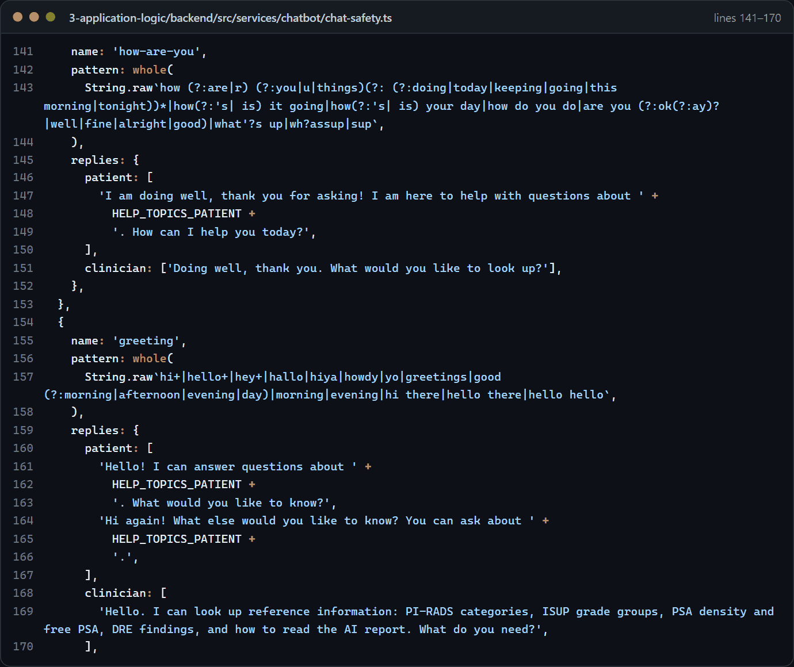

**To add a phrase,** add it to the `pattern` of the right intent, or add a new block to the `INTENTS` list in `chat-safety.ts`. Then add a line to the table in `chat-safety.spec.ts` and run:

```powershell
cd 3-application-logic\backend
node node_modules\jest\bin\jest.js src/services/chatbot
```

Only a message that is *nothing but* small talk counts: "hello, is my PSA bad?" still gets the safety reply.

### 9.4 The knowledge base

The assistant can only say what is in two files in `4-ai-intelligence-layer/knowledge-base/en/`:
- `patient-learn.json`: the app's Learn articles, word for word;
- `clinician-reference.json`: reference cards (PI-RADS, grade groups, PSA density, DRE findings, reading the AI report).

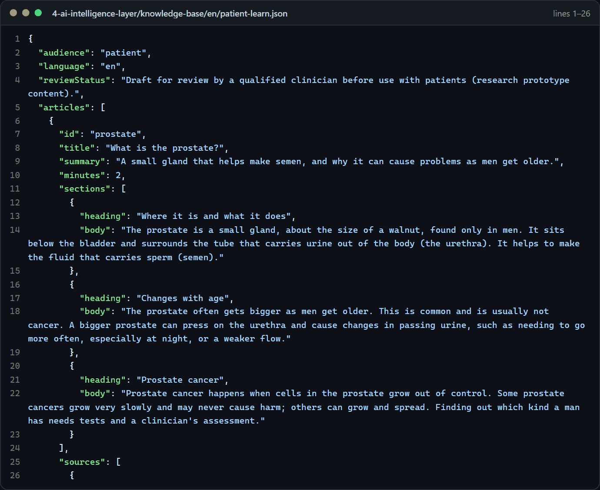

Every section of every article is one **passage** the assistant can use. The search is classic keyword matching (BM25): it needs no internet and no model, and every result can be explained by the words it shares with the question.


`answer.py` then decides: no good match means "no reviewed information"; with Claude, Claude writes from the three best passages; otherwise the best passages are quoted.


**To change what the assistant knows:**

1. Edit the JSON file. Keep each section short and complete in itself, and give every article a source.
2. If you changed `patient-learn.json`, copy it over `1-presentation-layer/mobile-app/assets/education/en/articles.json`. A test fails if the two differ.
3. Restart the AI service (it reads the files when it starts).
4. Run its tests: `.venv\Scripts\python -m pytest -q`.

The content says *"Draft for review by a qualified clinician"* until a clinician signs it off. Record a sign-off by changing `reviewStatus` in the file and noting the reviewer and date in the development log.

### 9.5 Claude (optional, costs money)

Claude is **off** on this PC: the health check says `chat_writer: quotes`. To switch it on:

1. Create an API key at console.anthropic.com.
2. Open `.env` and put the key after `ANTHROPIC_API_KEY=`. Never put it in a chat, an email or the code.
3. Restart the AI service. The health check then says `chat_writer: claude:claude-haiku-4-5-20251001`.

What Claude is told:

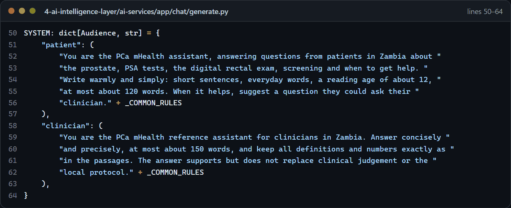

- Claude only receives the three best passages, the last three questions and answers, and the question. Email addresses, NRC numbers and phone numbers are removed first.
- It must answer through a fixed form (`covered`, `answer`, `citations`). Only passages it cites become the sources.
- Limits: 8 seconds, no retries, at most `CHAT_LLM_DAILY_LIMIT` (2,000) answers a day. On any problem the passages are quoted instead, so the chat works without Claude.
- Answers written by Claude are labelled *"Written by AI (Claude) from the sources below"*.
- **Before real patients:** questions would be sent to Anthropic in the United States. That needs a data-protection review first (ADR-010).

### 9.6 What the person sees

| Empty chat | An answer with its source | Casual chat |
|---|---|---|
|  |  |  |

| Past chats | Speaking a question |
|---|---|
|  |  |

These screens are drawn by the app's own code with synthetic data. The answer is the AI service's real answer to that question (quoted, because Claude is off), and the casual replies are the backend's real replies. In the recording picture a stand-in plays the part of the phone's speech service.

### 9.7 Testing the chatbot

| What | Command | Where |
|---|---|---|
| Safety rules and small talk (89 tests) | `node node_modules\jest\bin\jest.js src/services/chatbot` | `3-application-logic\backend` |
| The whole chat through the API and MongoDB (11 tests) | `node node_modules\jest\bin\jest.js --config ./test/jest-db.json --runInBand test/db/chatbot.int-spec.ts` | `3-application-logic\backend` |
| Search quality and Claude with a stand-in | `.venv\Scripts\python -m pytest -q` | `4-ai-intelligence-layer\ai-services` |
| The chat screens | `flutter test test/features/chat` | `1-presentation-layer\mobile-app` |

## 10. The phone app

### 10.1 How it is organised

`1-presentation-layer/mobile-app/lib`:

| Folder | What is inside |
|---|---|
| `main.dart` | the first code that runs |
| `app/` | the routes (which screen is at which address, and who may open it) and the theme (colours, type, shapes) |
| `core/` | shared machinery: `network` (talking to the API), `db` (the encrypted database on the phone), `sync` (sending offline work later), `storage` (the session tokens), `uploads` |
| `features/` | one folder per feature: `auth`, `home`, `patients`, `clinical_server`, `patient`, `chat`, `sync`, `settings` |
| `shared/` | widgets used everywhere (the header, tiles, the assistant's face) and `audio` (read-aloud) |

`main.dart` opens the phone's encrypted database and the saved preferences, then starts the app:

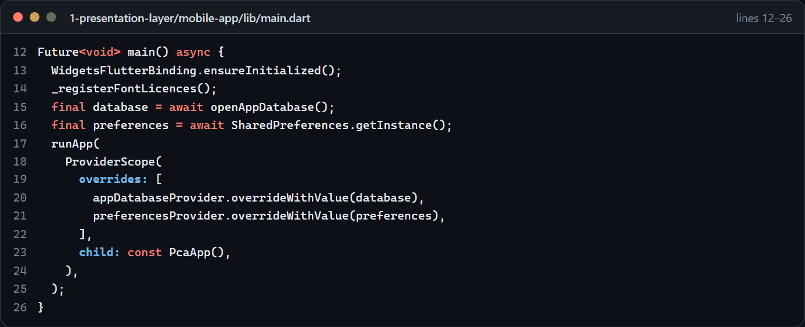

The only setting built into the app is the server's address. No secret is ever compiled in:

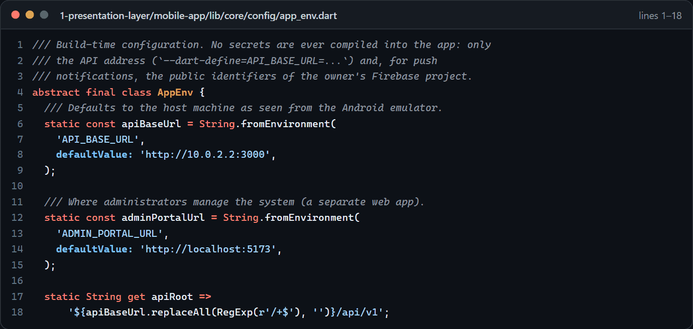

### 10.2 Running the app

**On the emulator** (the backend must be running):

```powershell
flutter emulators --launch Galaxy_S9_Plus_API_29
cd 1-presentation-layer\mobile-app
flutter pub get      # only after pubspec.yaml changed
flutter run -d emulator-5554 --dart-define=API_BASE_URL=http://10.0.2.2:3000
```

`10.0.2.2` is how the emulator reaches this PC. While `flutter run` is open, press **r** to reload after a code change, **R** to restart the app, **q** to quit. In Android Studio, the run configuration **App - S9+ emulator** does the same.

**On a real Android phone by USB:**

1. On the phone: Settings › Developer options › USB debugging on. Plug it in and tap **Allow**.
2. `powershell -ExecutionPolicy Bypass -File 6-infrastructure\scripts\phone-usb.ps1` (it lets the phone reach the PC's port 3000).
3. `flutter run --dart-define=API_BASE_URL=http://localhost:3000`, or the Android Studio configuration **App - USB phone**.

**To make an installable file (APK):**

```powershell
flutter build apk --release --dart-define=API_BASE_URL=https://your-server.example
```

The file appears in `build\app\outputs\flutter-apk\app-release.apk`. A release build for the public also needs a signing key and an HTTPS server address.

### 10.3 How the app is put together

- **State** is managed with Riverpod: a *controller* holds the state of one screen and the screen redraws when it changes. The chat controller is a typical example:


- **Talking to the server:** `core/network/api_client.dart` adds the session token to every request, renews it when it has expired, and turns server errors into plain messages.
- **Offline:** clinicians' work is saved first in an encrypted database on the phone (Drift with SQLCipher) and sent when the connection returns (`core/sync`). The server re-checks every change with the same rules as online.
- **Session tokens** are kept in the phone's secure storage, never in plain files.
- **Permissions:** the app only asks for the internet and, when the microphone is first tapped, the microphone.

### 10.4 Voice and reading aloud

Both use the phone's own speech services, behind small interfaces, so tests can replace them with stand-ins.

**Voice** (`features/chat/application/voice_input.dart`): the phone turns speech into text, and the app only receives the words.


**Read-aloud** (`shared/audio/read_aloud.dart`): an article is read part by part, so the screen can highlight the part being read.


The assistant's face is not a picture file. It is drawn by code, so it is sharp at every size:

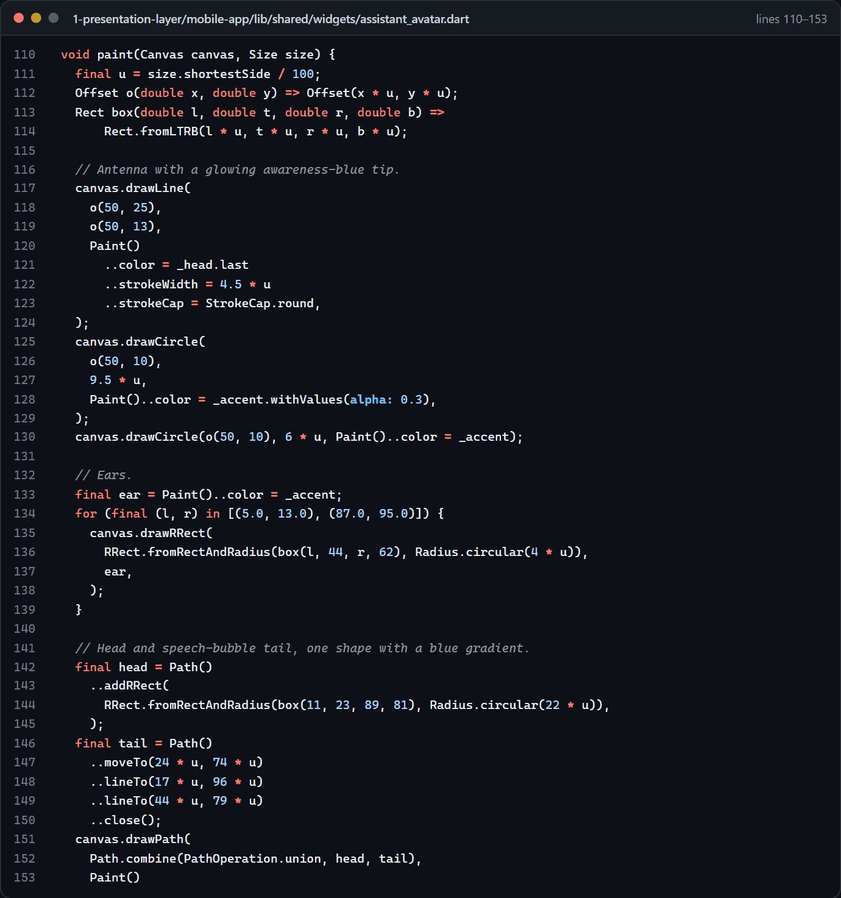

### 10.5 What it looks like

| Sign-in | Patient home (emulator) | Learn, dark mode |
|---|---|---|
|  |  |  |

| An article being read aloud (emulator) | Clinician home, dark mode |
|---|---|
|  |  |

### 10.6 App commands

Run these in `1-presentation-layer\mobile-app`:

| Task | Command |
|---|---|
| Get packages | `flutter pub get` |
| Check the code | `flutter analyze` |
| Format | `dart format lib test` |
| All tests | `flutter test` |
| One test file | `flutter test test/features/chat/chat_test.dart` |
| Build a debug APK | `flutter build apk --debug` |
| List devices | `flutter devices` |

## 11. The admin website

`1-presentation-layer/admin-panel-web`, a React application. Only administrators can sign in.

| Page | What it is for |
|---|---|
| Dashboard | what is happening in the phone app: sign-ins, records, sync health (counts only, no patient names) |
| Users | every account: roles, facility, switch off, unlock, reset password, **delete** |
| Roles & permissions | what each role may do |
| Patient accounts | link a patient's sign-in to their clinic record |
| FHIR export | export records for SmartCare Pro |
| Audit log | who did what, and **Check integrity** |


These pictures show the real website, but the API's answers were replaced with synthetic ones while they were taken: the accounts are not real, and the dashboard's numbers were made up for the picture.

The dialog in that picture is this code in `src/pages/UsersPages.tsx`:

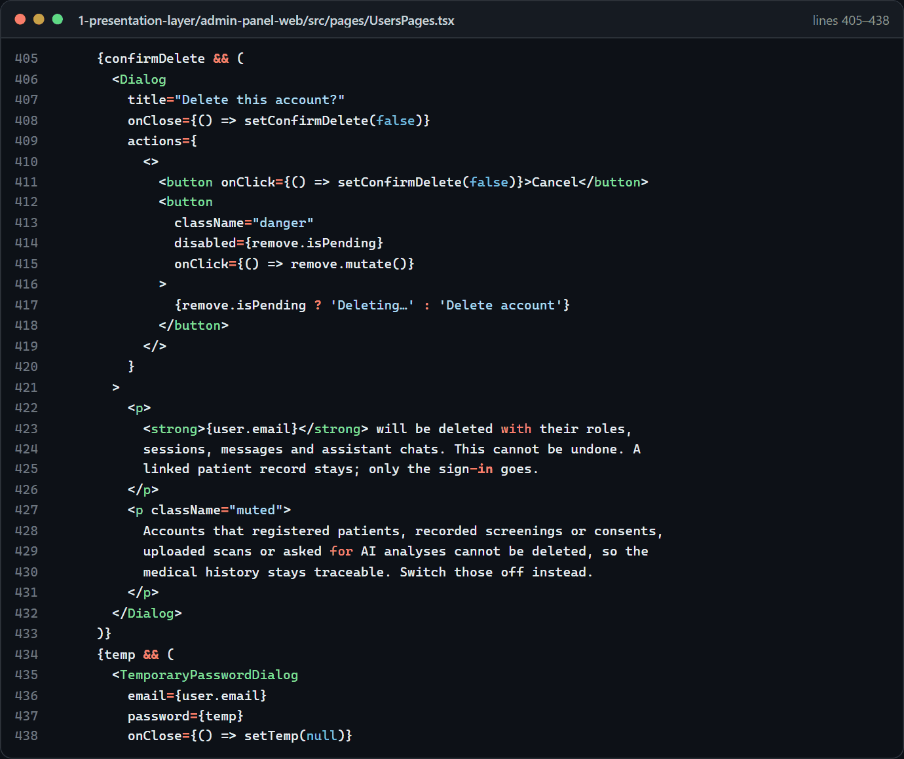

**Commands** (in `1-presentation-layer\admin-panel-web`):

| Task | Command |
|---|---|
| Run for development | `npm run dev` |
| Tests | `npm test` |
| Tests with coverage | `npm run test:cov` |
| Lint, types | `npm run lint`, `npm run typecheck` |
| Build the files for a web server | `npm run build` (output in `dist/`) |

## 12. Tests and the quality gate

One script checks a whole part: formatting, lint, types, tests, build and a scan of the packages for known problems.

```powershell
$gate = "6-infrastructure\scripts\quality-gate.ps1"
powershell -ExecutionPolicy Bypass -File $gate backend
powershell -ExecutionPolicy Bypass -File $gate mobile
powershell -ExecutionPolicy Bypass -File $gate admin-web
powershell -ExecutionPolicy Bypass -File $gate ai
# The databases' tests (needs the databases and Docker):
powershell -ExecutionPolicy Bypass -File $gate db
# Every link in the docs works; are the manual's pictures current?
powershell -ExecutionPolicy Bypass -File $gate docs
# No password or key in Git:
powershell -ExecutionPolicy Bypass -File $gate secrets
powershell -ExecutionPolicy Bypass -File $gate all
```

`quality-gate.ps1` runs the real script, `quality-gate.sh`, with the `bash` that comes with Git for Windows. In **Git Bash** you can run that directly: `bash 6-infrastructure/scripts/quality-gate.sh backend`. Do not type `bash …` in PowerShell: on this PC it starts Windows' WSL, not Git Bash.


**Where things stood on 30 September 2026:**

| Part | Tests |
|---|---|
| Backend unit tests | 307 |
| Backend end-to-end tests | 20 |
| Backend database tests | 230 |
| AI service | 65, and 1 skipped (it would call the real Claude) |
| Phone app | 280 (line coverage 90.9%) |
| Admin website | 81 (coverage 87.8%) |

**The rule the project has followed:** no commit unless the gate for the changed part passes. If a test fails, fix the code or, if the behaviour really should change, change the test and say why in the commit.

## 13. Git and GitHub

- The code is in a **private** GitHub repository, `deedeestephen/final-year-project`, branch `main`.
- The history is one commit per finished piece of work, with a message that says what and why.

```powershell
git status                       # what changed
git diff                         # the changes, line by line
git add -A                       # stage everything
git commit -m "What changed and why"
git push origin main             # send to GitHub
git log --oneline -10            # the last ten commits
git pull origin main             # get changes from GitHub
```

**Never commit** `.env`, passwords, keys or real patient data. Before committing, run `powershell -ExecutionPolicy Bypass -File 6-infrastructure\scripts\quality-gate.ps1 secrets`.

## 14. When something goes wrong

| What you see | Likely cause | What to do |
|---|---|---|
| `dev-up.ps1`: *The .env file is missing* | new folder or new PC | `node 6-infrastructure\scripts\gen-keys.mjs --init-env`, then set the database passwords |
| `dev-up.ps1`: *Database migration failed* | PostgreSQL is stopped, or `DATABASE_URL` is wrong | `Get-Service postgresql-x64-18`; check the port (5432) and password in `.env` |
| `dev-up.ps1`: *docker compose failed* | Docker Desktop is not running | open Docker Desktop, wait for "Engine running", run again |
| Backend window: `EADDRINUSE :::3000` | an old backend still runs | run `dev-down.ps1`, then `dev-up.ps1` |
| Backend window: MongoDB `Authentication failed` | `MONGO_URL` and the `pca` password differ | see the troubleshooting table in [local-databases.md](local-databases.md) |
| Admin website: *Email or password is incorrect* | wrong password, or it was changed | use `SEED_DEMO_PASSWORD` from `.env` (not `.env.example`), or `dev-up.ps1 -ResetDemoPasswords` |
| *This account is temporarily locked* | 5 wrong tries | wait 15 minutes, or `dev-up.ps1 -ResetDemoPasswords` |
| Admin website: *Cannot reach the server* | the backend is not running | check http://localhost:3000/api/v1/health |
| App: *Cannot reach the server* on the emulator | the backend is not running, or the wrong address | the address must be `http://10.0.2.2:3000` on the emulator |
| App shows a white screen after the PC restarted | a debug build needs `flutter run` | run `flutter run` again (section 10.2) |
| Chat: *The assistant is not available right now* | the AI service is not running | start it (section 3.4) and check http://127.0.0.1:8000/v1/health |
| Chat always answers *No reviewed information* | the question is outside the knowledge base | expected; add content (section 9.4) |
| Voice: *I did not hear anything* on the emulator | the emulator's microphone is off | emulator › ⋮ › Microphone › *Virtual microphone uses host audio input*, or use a real phone |
| A test run ends at once with exit code 127 and no output | the PC ran out of memory | close Android Studio or the emulator, run `cd android; .\gradlew --stop`, try again |
| Docker prints *The "…" variable is not set* | a `.env` value contains `$` without quotes | put the value in single quotes |
| pgAdmin does not open | it must be started from the Start menu | Start › PostgreSQL 18 › pgAdmin 4 |

**Where the messages are**
- Backend: its PowerShell window.
- AI service: its PowerShell window.
- Admin website: the browser's console (press F12).
- App: the `flutter run` window.
- Docker: `docker compose … logs <service>`.
- What happened in the system: the **Audit log** page on the admin website.

## 15. Before real patients

The prototype runs on synthetic data. These are still needed before any real use, and none of them is a programming task alone:

- **Trained and evaluated AI models.** The mocks stay labelled until then.
- **A clinician's sign-off** of the knowledge base, and **human-verified Bemba and Nyanja** translations.
- **A data-protection review** under Zambia's Data Protection Act (2021) and ethics approval, covering the speech service and, if used, Claude.
- **MongoDB access control switched on**, and a proper server with HTTPS, backups and monitoring. The list is in [security-review.md](security-review.md), items R-1 to R-8.

## 16. Where to read more

| Question | Read |
|---|---|
| How do I test every feature by hand? | [how-to-test.md](how-to-test.md) |
| Why was it built this way? | [architecture.md](architecture.md) and [decisions/](decisions/) |
| What was done, when, and what was found? | [development-log.md](development-log.md) |
| Which requirement is met by what, and how is it tested? | [requirements-traceability.md](requirements-traceability.md) |
| The databases on this PC | [local-databases.md](local-databases.md) and [database.md](database.md) |
| The phone app in depth | [mobile.md](mobile.md) |
| Security | [security.md](security.md), [security-review.md](security-review.md), [access-matrix.md](access-matrix.md) |
| The chatbot's design | [chatbot-plan.md](chatbot-plan.md), [ADR-009](decisions/ADR-009-offline-extractive-chatbot.md), [ADR-010](decisions/ADR-010-claude-for-chat-answers.md) |
| Swapping the mock AI models for real ones | [ai-model-integration-guide.md](ai-model-integration-guide.md) |
| Speed and load | [performance.md](performance.md), [scalability.md](scalability.md) |

## 17. Updating this manual

This text is `docs/operations-manual.md`: change it in any editor. Its pictures, its PDF and its web page are made by a tool in `docs/report/tools`, from this text and from the code, so they can be made again whenever either changes:

```powershell
$report = "docs\report\tools\report.ps1"
# What is out of date:
powershell -ExecutionPolicy Bypass -File $report check
# After changing only the text:
powershell -ExecutionPolicy Bypass -File $report pdf html
# After changing code that a picture shows:
powershell -ExecutionPolicy Bypass -File $report code images pdf html
# Everything (start dev-up.ps1 first):
powershell -ExecutionPolicy Bypass -File $report all
```

- It needs Python, Node and Chrome (or Edge). The first run installs three small Python packages.
- `docs/report/tools/contents.py` lists what each picture shows: which file and lines, which command, which phone screen.
- The quality gate's `docs` target runs `check`. It warns when a code picture shows code that has changed since the picture was taken.
- Every step, what it needs, and what to do when one stops: [report/tools/README.md](report/tools/README.md).

A PDF of this manual is in [report/PCa-mHealth-operations-manual.pdf](report/PCa-mHealth-operations-manual.pdf), and a web page (open it in a browser) in [report/operations-manual.html](report/operations-manual.html).
