# Figures for the final-year report

The diagrams, screens and code pictures for the final-year report, in the order of the chapters in the ZCAS undergraduate project guide. Each figure has a suggested number and caption, what it shows, and its files.

- **To put a figure in Word:** Insert › Pictures › the `.png` file. The PNGs are drawn at high resolution, so they stay sharp when printed.
- **To restyle a figure in Figma or Canva:** import the `.svg` file. It is a vector drawing, so every box and line can be moved and recoloured.
- **They are made from the project itself.** The diagrams are text files (PlantUML) in `docs/report/diagrams`. The database diagrams, the API map and the actual timeline are generated from the database schema, the access matrix and the Git history, so they cannot drift from the code. After a change, run `powershell -ExecutionPolicy Bypass -File docs\report\tools\report.ps1 diagrams figures`; [report/tools/README.md](report/tools/README.md) explains it.
- **Honesty notes for the captions:** the AI analysis uses labelled **mock** models (their numbers come from a hash of the job id, not from patient data), all data is **synthetic**, and the knowledge base still awaits a clinician's sign-off. Say so wherever a figure shows them.
- The numbers below are suggestions; renumber them to fit your report.

A PDF of these figures is in [report/PCa-mHealth-report-figures.pdf](report/PCa-mHealth-report-figures.pdf).

---

## Chapter 1: Introduction

### 1.5 Implementation plan

#### Figure 1.1: Planned timeline (from the research proposal)

The nine phases and twelve months of the proposal's Gantt chart (§3.10, Figure 3), redrawn. The proposal gives months M1 to M12, not dates.

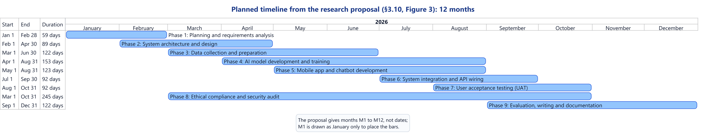

Files: [PNG](report/figures/gantt-planned.png) · [SVG](report/figures/gantt-planned.svg) · source [gantt-planned.puml](report/diagrams/gantt-planned.puml)

#### Figure 1.2: Actual build timeline (from the Git history)

One diamond per commit, on the day it was made, from the first analysis to the latest change. Useful in Chapter 5 to compare the plan with what happened.

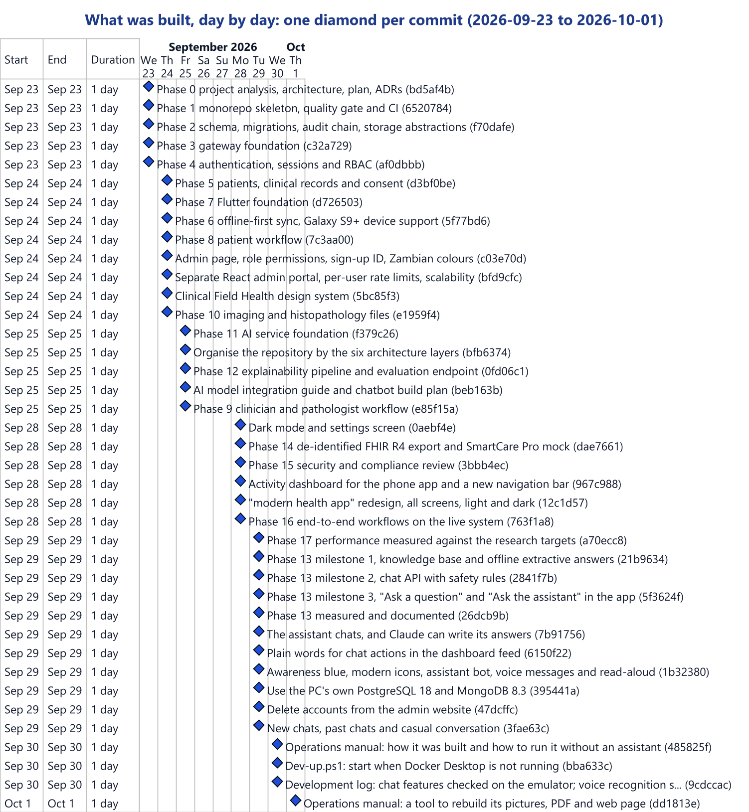

Files: [PNG](report/figures/gantt-actual.png) · [SVG](report/figures/gantt-actual.svg) · source generated from `git log`

---

## Chapter 3: System analysis and design

### 3.3 System development method

#### Figure 3.1: The iterative prototyping cycle as followed

How each phase went through design refinement, development, internal testing (the quality gate) and evaluation, as in proposal §3.2.

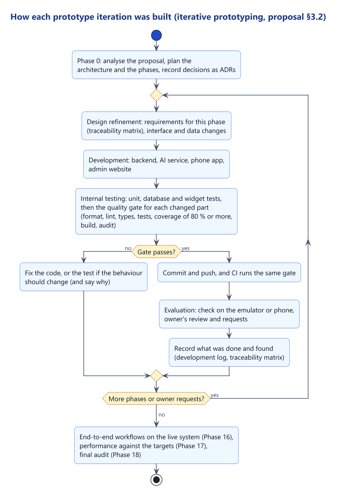

Files: [PNG](report/figures/activity-prototyping-cycle.png) · [SVG](report/figures/activity-prototyping-cycle.svg) · source [activity-prototyping-cycle.puml](report/diagrams/activity-prototyping-cycle.puml)

### 3.4 Data and process modelling

#### Figure 3.2: Context diagram (DFD level 0)

The whole platform as one process, with the people and systems around it and the data that flows between them.

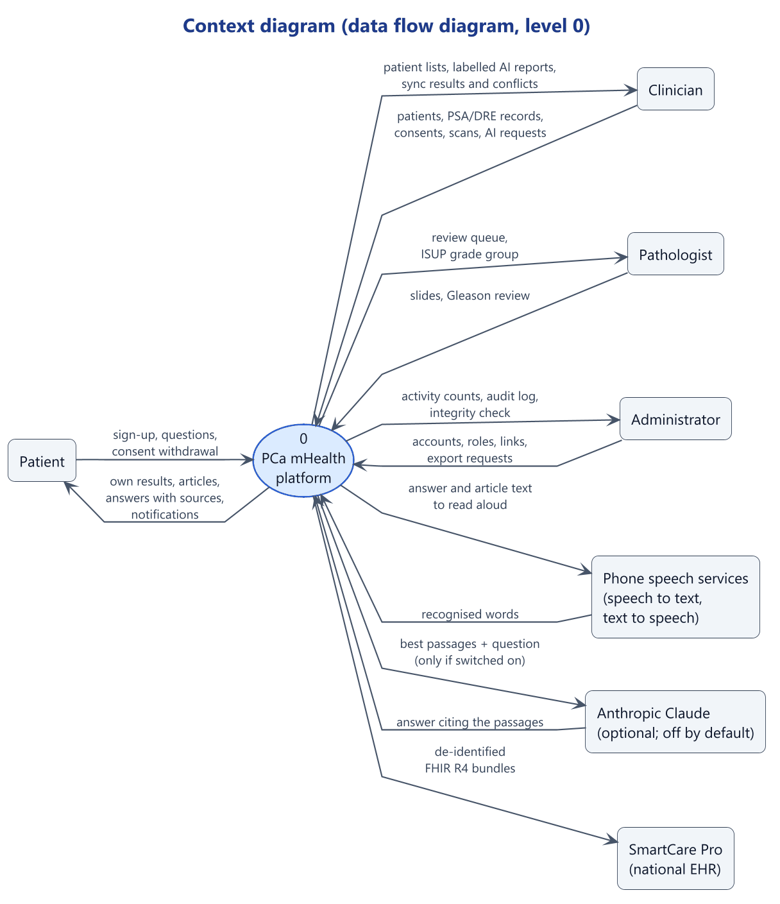

Files: [PNG](report/figures/context-diagram.png) · [SVG](report/figures/context-diagram.svg) · source [context-diagram.puml](report/diagrams/context-diagram.puml)

#### Figure 3.3: Data flow diagram, level 1

The eight main processes, the eight data stores (D1 to D8) and the flows between them and the users.

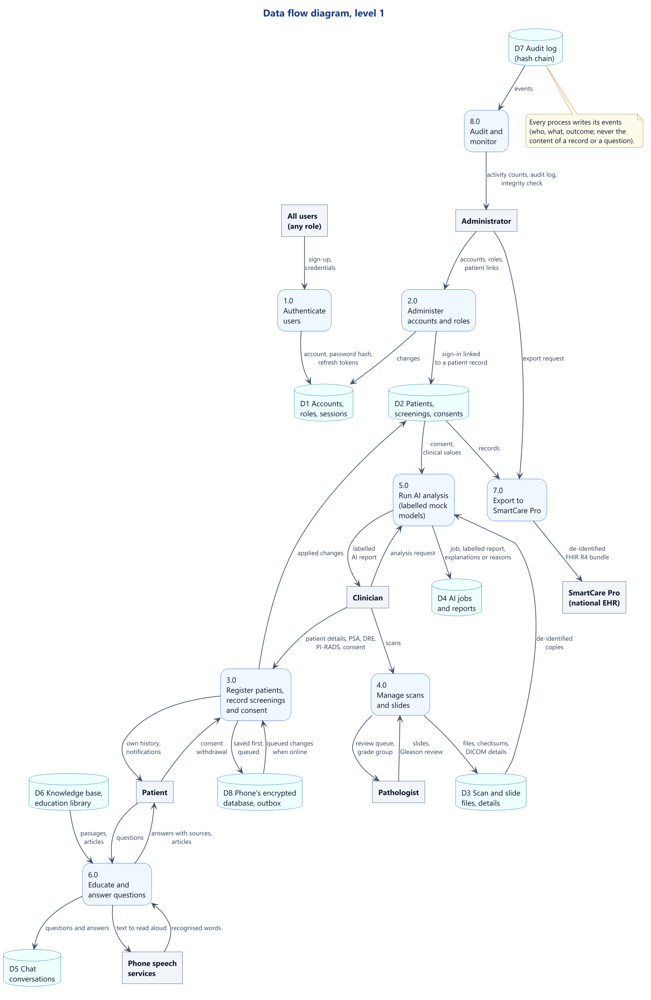

Files: [PNG](report/figures/dfd-level-1.png) · [SVG](report/figures/dfd-level-1.svg) · source [dfd-level-1.puml](report/diagrams/dfd-level-1.puml)

#### Figure 3.4: Data flow diagram, level 2: the assistant and education

Process 6.0 in detail: speech to text on the phone, the safety check, small talk, the knowledge-base search, writing and checking the answer, storing it, and reading articles aloud.

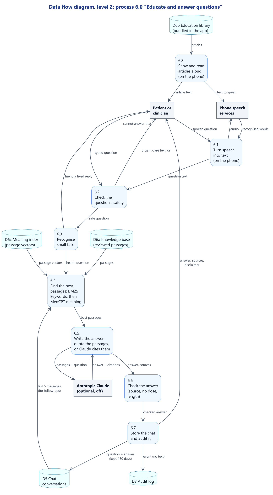

Files: [PNG](report/figures/dfd-level-2-chatbot.png) · [SVG](report/figures/dfd-level-2-chatbot.svg) · source [dfd-level-2-chatbot.puml](report/diagrams/dfd-level-2-chatbot.puml)

#### Figure 3.5: Use case diagram: the whole system (UC-01 to UC-12)

The twelve use cases of the proposal (§3.4) with their actors. Yellow: partly built; grey and dashed: left for later work.

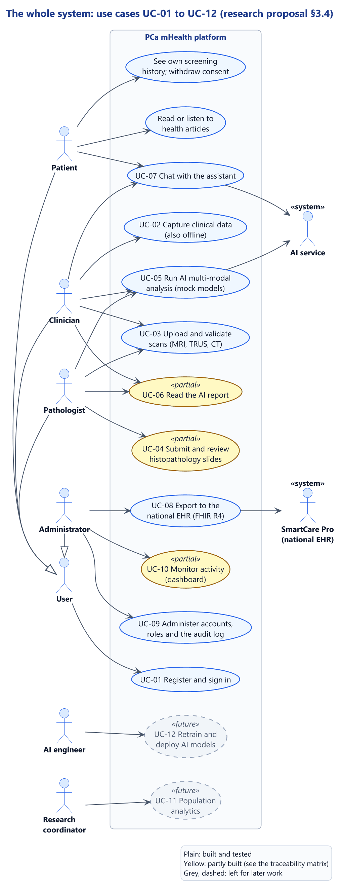

Files: [PNG](report/figures/usecase-system.png) · [SVG](report/figures/usecase-system.svg) · source [usecase-system.puml](report/diagrams/usecase-system.puml)

#### Figure 3.6: Use case diagram: the phone app

What patients, clinicians and pathologists can do in the app, with the include and extend relations (for example, saving on the phone and syncing is included in registering a patient).

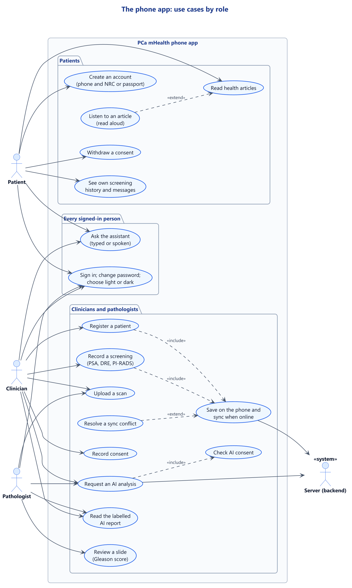

Files: [PNG](report/figures/usecase-mobile-app.png) · [SVG](report/figures/usecase-mobile-app.svg) · source [usecase-mobile-app.puml](report/diagrams/usecase-mobile-app.puml)

#### Figure 3.7: Use case diagram: the assistant (UC-07)

Asking by typing or voice, the safety check that is always included, the kinds of answers, listening to an answer, and managing chats.

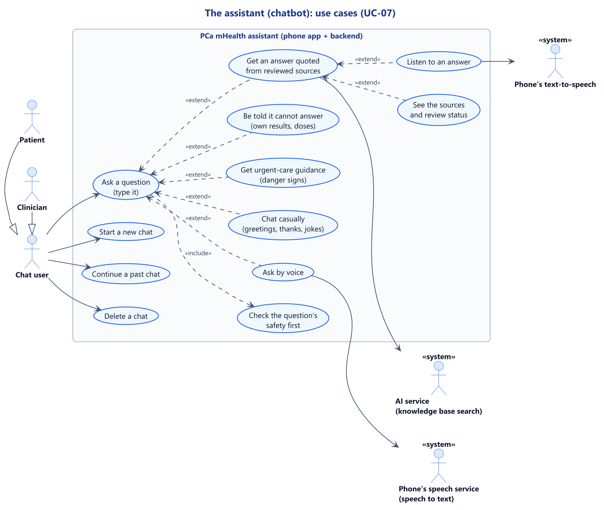

Files: [PNG](report/figures/usecase-chatbot.png) · [SVG](report/figures/usecase-chatbot.svg) · source [usecase-chatbot.puml](report/diagrams/usecase-chatbot.puml)

#### Figure 3.8: Activity diagram: how the assistant answers a message

Every decision from the request limit to the stored answer: urgent-care signs, medicines, a patient's own results, small talk, the knowledge-base search (keywords, then meaning) and the answer check.

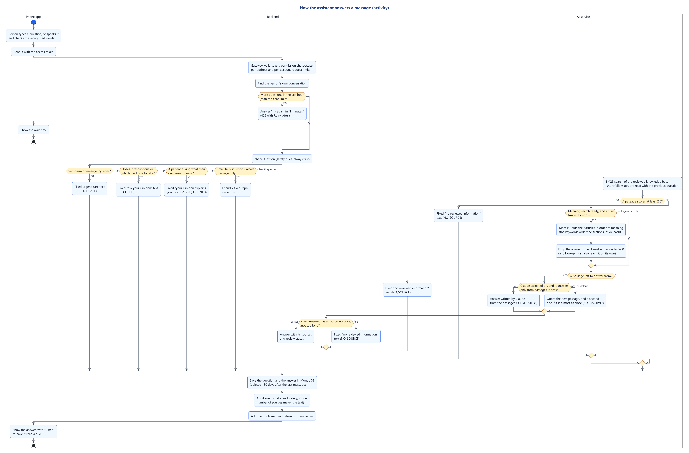

Files: [PNG](report/figures/activity-chat-answer.png) · [SVG](report/figures/activity-chat-answer.svg) · source [activity-chat-answer.puml](report/diagrams/activity-chat-answer.puml)

#### Figure 3.9: Activity diagram: saving patients and screenings with or without internet

The offline-first design (FR-03): saved on the phone first, sent in batches with idempotency keys, and the three results (applied, conflict, rejected).

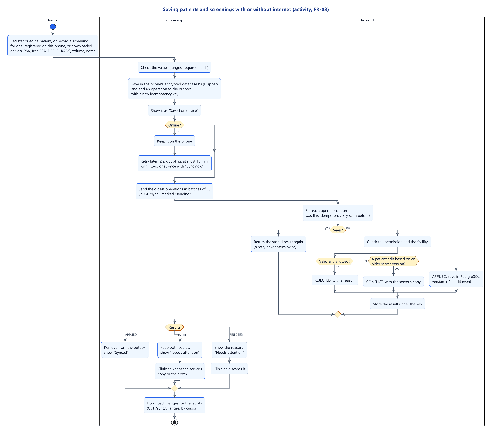

Files: [PNG](report/figures/activity-offline-capture.png) · [SVG](report/figures/activity-offline-capture.svg) · source [activity-offline-capture.puml](report/diagrams/activity-offline-capture.puml)

#### Figure 3.10: Activity diagram: asking by voice and listening to the answer

Voice input with the phone's own speech service, and read-aloud (ADR-012).

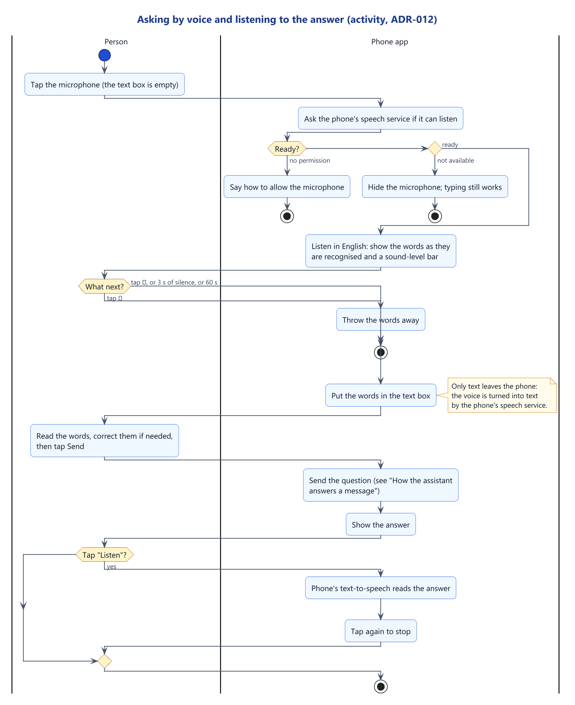

Files: [PNG](report/figures/activity-voice-question.png) · [SVG](report/figures/activity-voice-question.svg) · source [activity-voice-question.puml](report/diagrams/activity-voice-question.puml)

#### Figure 3.11: Activity diagram: requesting an AI analysis

The consent, record and one-at-a-time checks, the de-identified inputs, the queue, and the labelled mock result.

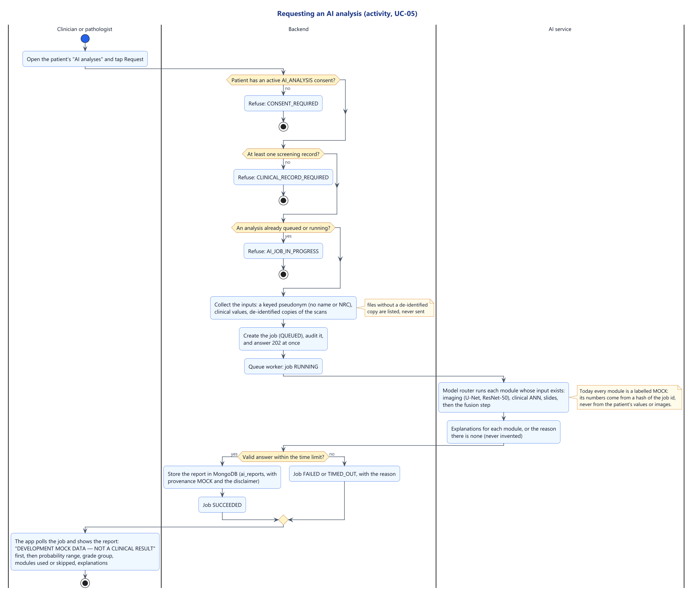

Files: [PNG](report/figures/activity-ai-analysis.png) · [SVG](report/figures/activity-ai-analysis.svg) · source [activity-ai-analysis.puml](report/diagrams/activity-ai-analysis.puml)

#### Figure 3.12: Sequence diagram: signing in and renewing the session

Sign-in with lockout after five failures, the short-lived access token, and refresh-token rotation with theft detection.

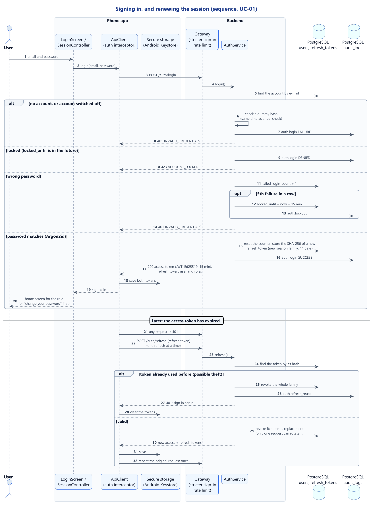

Files: [PNG](report/figures/sequence-sign-in.png) · [SVG](report/figures/sequence-sign-in.svg) · source [sequence-sign-in.puml](report/diagrams/sequence-sign-in.puml)

#### Figure 3.13: Sequence diagram: asking the assistant a question

From the chat screen through the gateway guards, the chatbot service and the AI service to MongoDB and the audit log.

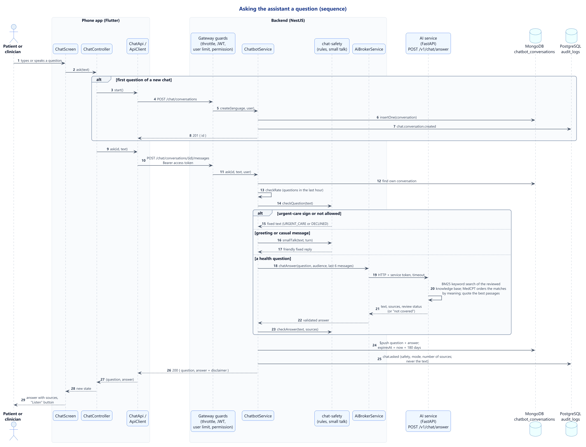

Files: [PNG](report/figures/sequence-chat.png) · [SVG](report/figures/sequence-chat.svg) · source [sequence-chat.puml](report/diagrams/sequence-chat.puml)

#### Figure 3.14: Sequence diagram: offline capture and synchronisation

The outbox on the phone, the batch sent to the server, the per-operation results, and downloading the facility's changes.

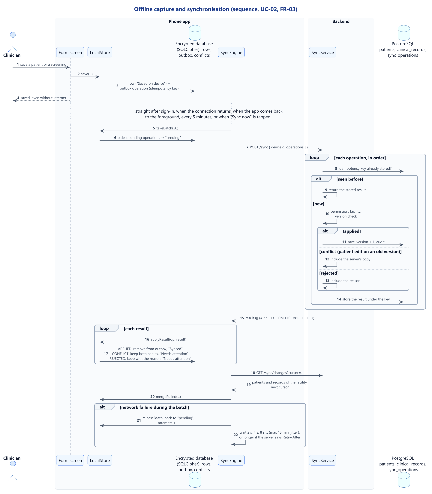

Files: [PNG](report/figures/sequence-offline-sync.png) · [SVG](report/figures/sequence-offline-sync.svg) · source [sequence-offline-sync.puml](report/diagrams/sequence-offline-sync.puml)

#### Figure 3.15: Sequence diagram: requesting and reading an AI analysis

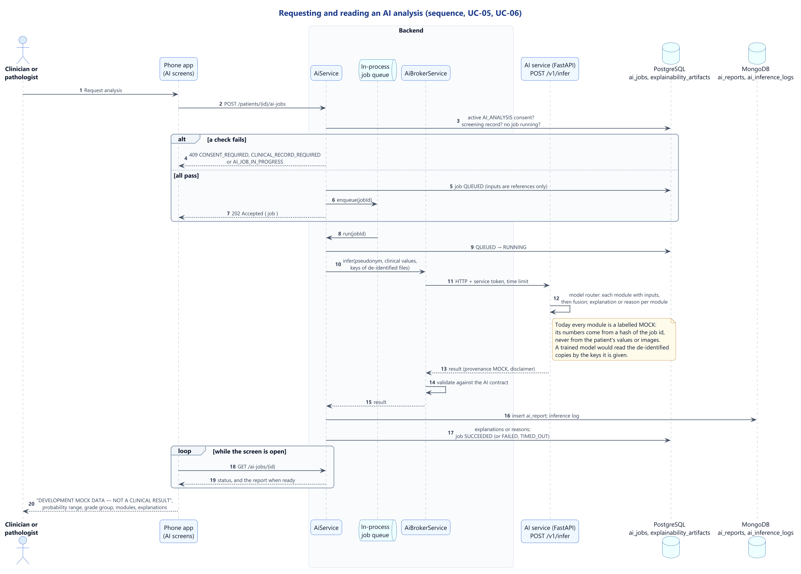

Files: [PNG](report/figures/sequence-ai-analysis.png) · [SVG](report/figures/sequence-ai-analysis.svg) · source [sequence-ai-analysis.puml](report/diagrams/sequence-ai-analysis.puml)

#### Figure 3.16: Sequence diagram: exporting de-identified records to SmartCare Pro

The FHIR R4 export (UC-08) with Safe Harbor de-identification of all 18 identifier classes.

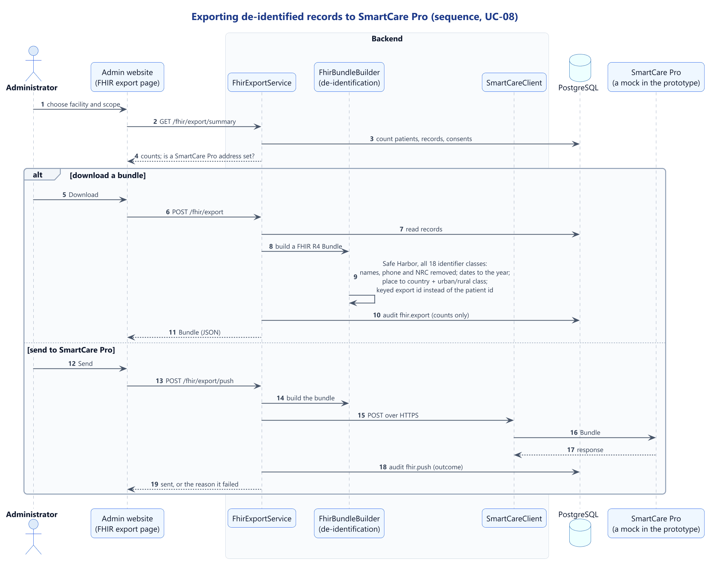

Files: [PNG](report/figures/sequence-fhir-export.png) · [SVG](report/figures/sequence-fhir-export.svg) · source [sequence-fhir-export.puml](report/diagrams/sequence-fhir-export.puml)

#### Figure 3.17: Sequence diagram: push notifications

A patient's phone is registered after sign-in; a new notification is claimed by the outbox and sent through Firebase Cloud Messaging (text only, hidden on a locked phone); a tap opens the messages; sign-out removes the phone (ADR-014). Push is switched on with the owner's Firebase project.

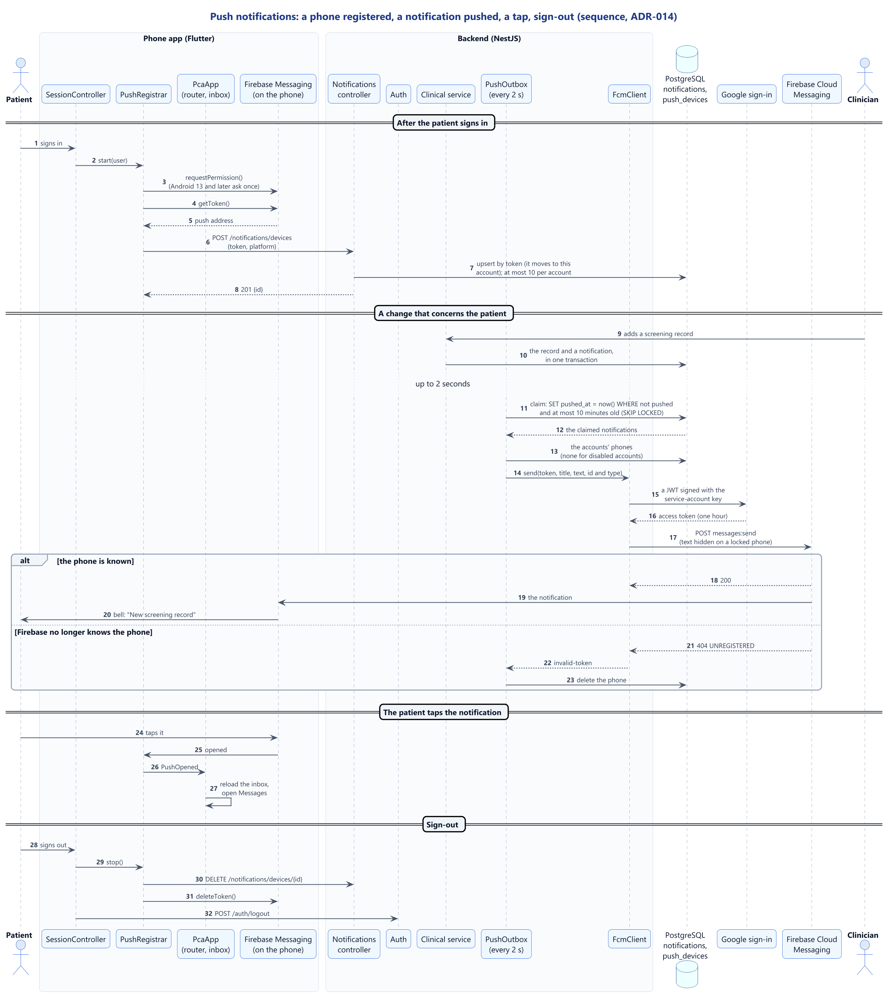

Files: [PNG](report/figures/sequence-push.png) · [SVG](report/figures/sequence-push.svg) · source [sequence-push.puml](report/diagrams/sequence-push.puml)

#### Figure 3.18: State diagram: a change saved on the phone

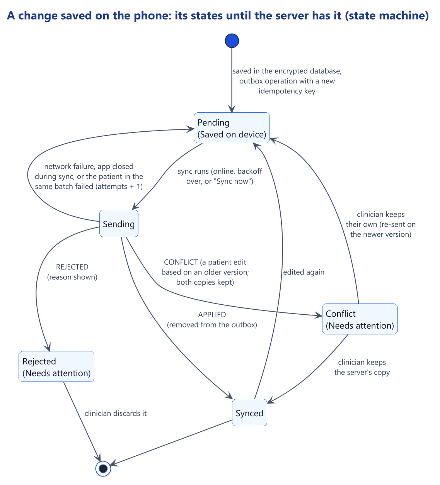

Files: [PNG](report/figures/state-offline-change.png) · [SVG](report/figures/state-offline-change.svg) · source [state-offline-change.puml](report/diagrams/state-offline-change.puml)

#### Figure 3.19: State diagram: an AI analysis job

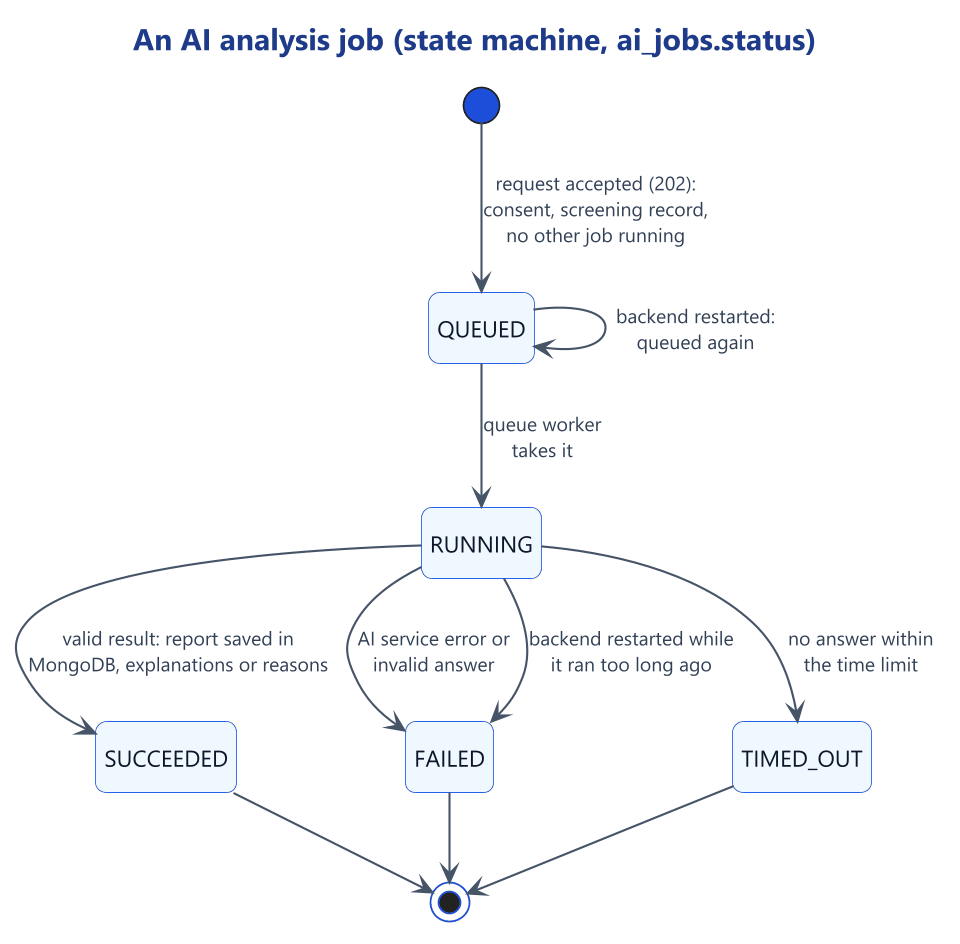

Files: [PNG](report/figures/state-ai-job.png) · [SVG](report/figures/state-ai-job.svg) · source [state-ai-job.puml](report/diagrams/state-ai-job.puml)

#### Figure 3.20: State diagram: the chat's message box with voice input

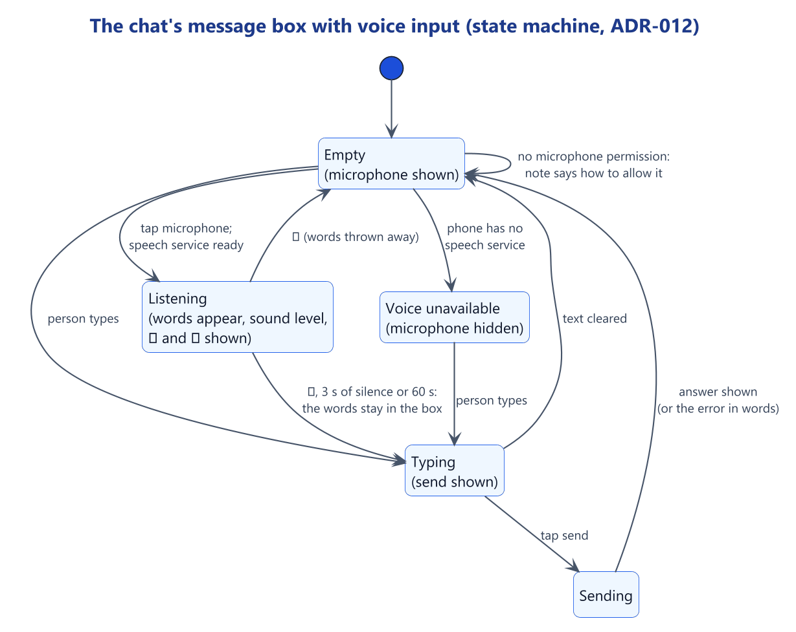

Files: [PNG](report/figures/state-voice-input.png) · [SVG](report/figures/state-voice-input.svg) · source [state-voice-input.puml](report/diagrams/state-voice-input.puml)

### 3.5 Program design, database design and interface design

#### Figure 3.21: The six-layer architecture as built

The proposal's six layers (§3.3) with what each contains in the prototype.

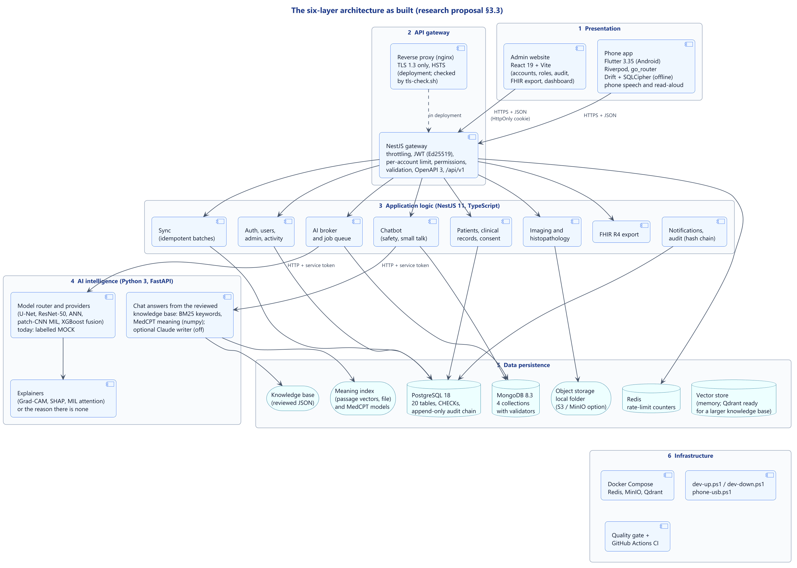

Files: [PNG](report/figures/architecture-layers.png) · [SVG](report/figures/architecture-layers.svg) · source [architecture-layers.puml](report/diagrams/architecture-layers.puml)

#### Figure 3.22: Deployment diagram

Where each part runs: the phone or emulator, the laptop's Windows services, Node.js, Python and Docker, and the outside services.

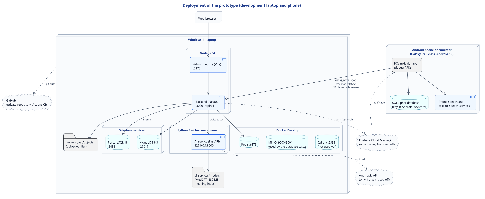

Files: [PNG](report/figures/deployment.png) · [SVG](report/figures/deployment.svg) · source [deployment.puml](report/diagrams/deployment.puml)

#### Figure 3.23: Component diagram: the backend modules

The NestJS modules and their real dependencies (taken from the services' constructors), and the order of the gateway guards.

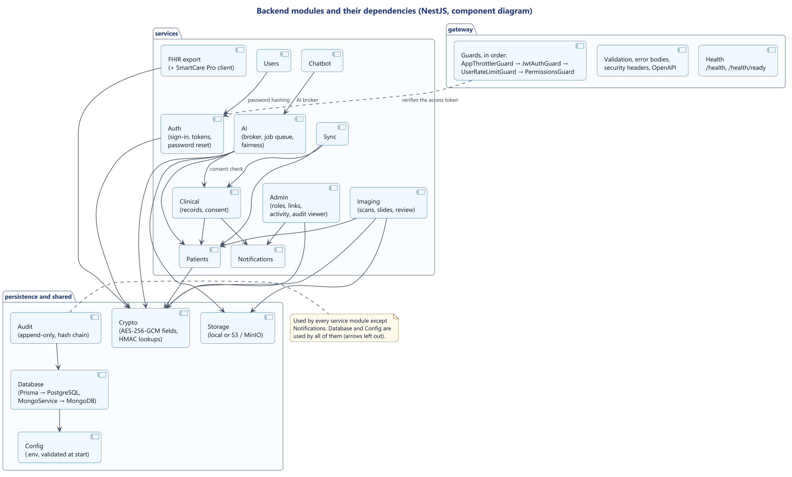

Files: [PNG](report/figures/component-backend.png) · [SVG](report/figures/component-backend.svg) · source [component-backend.puml](report/diagrams/component-backend.puml)

#### Figure 3.24: Class diagram: the app's assistant, voice input and read-aloud

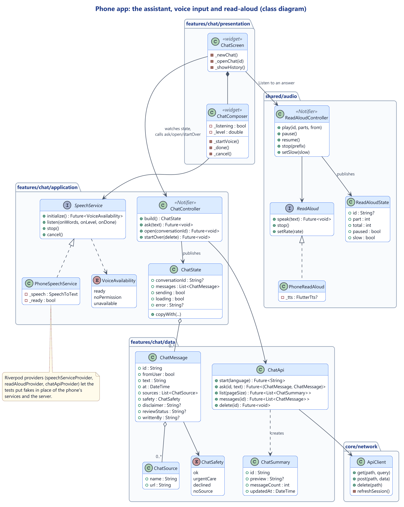

Files: [PNG](report/figures/class-app-chat-audio.png) · [SVG](report/figures/class-app-chat-audio.svg) · source [class-app-chat-audio.puml](report/diagrams/class-app-chat-audio.puml)

#### Figure 3.25: Class diagram: the app's offline storage and synchronisation

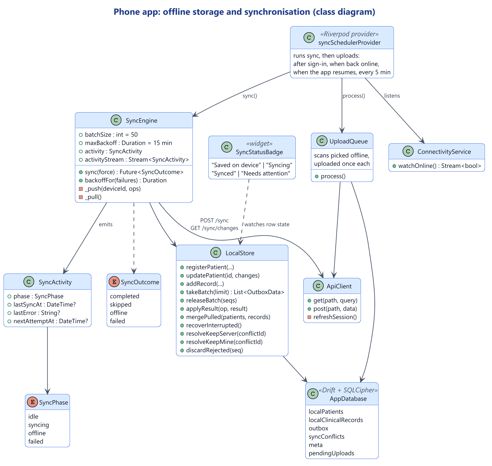

Files: [PNG](report/figures/class-app-offline.png) · [SVG](report/figures/class-app-offline.svg) · source [class-app-offline.puml](report/diagrams/class-app-offline.puml)

#### Figure 3.26: Class diagram: the assistant on the server

The backend's chatbot module and the AI service's chat module (keyword retrieval, the MedCPT meaning search, knowledge base, optional Claude writer).

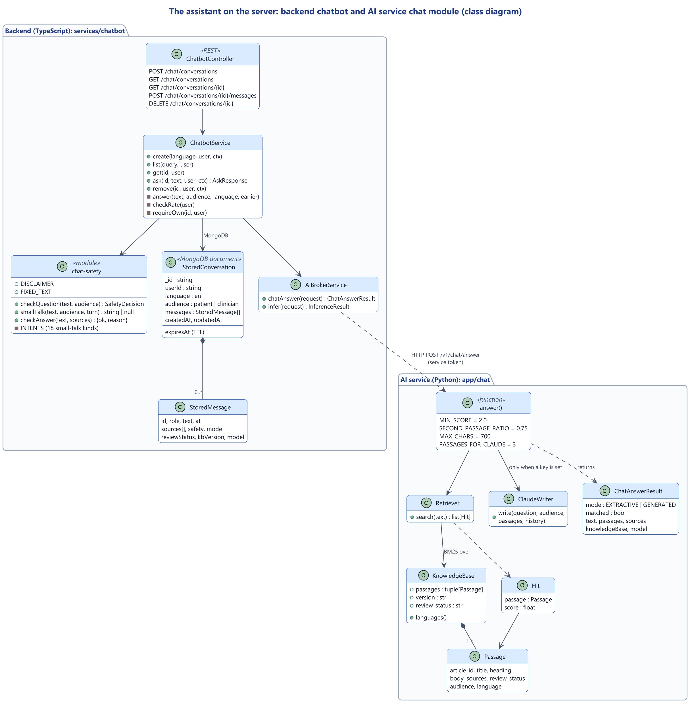

Files: [PNG](report/figures/class-chat-server.png) · [SVG](report/figures/class-chat-server.svg) · source [class-chat-server.puml](report/diagrams/class-chat-server.puml)

#### Figure 3.27: API diagram: every route, its permission and its default roles

All REST routes under `/api/v1`, grouped by resource, with the apps whose users may call them, and the AI service's internal API. Generated from [access-matrix.md](access-matrix.md).

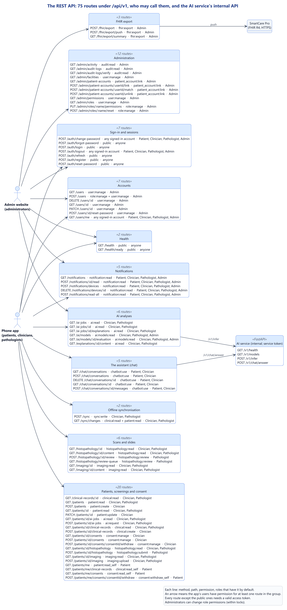

Files: [PNG](report/figures/api-map.png) · [SVG](report/figures/api-map.svg) · source generated: [api-map.puml](report/diagrams/generated/api-map.puml)

#### Figure 3.28: The API explorer (OpenAPI 3, Swagger UI)

The backend describes its own API at `http://localhost:3000/api/docs` (screenshot of the running backend).

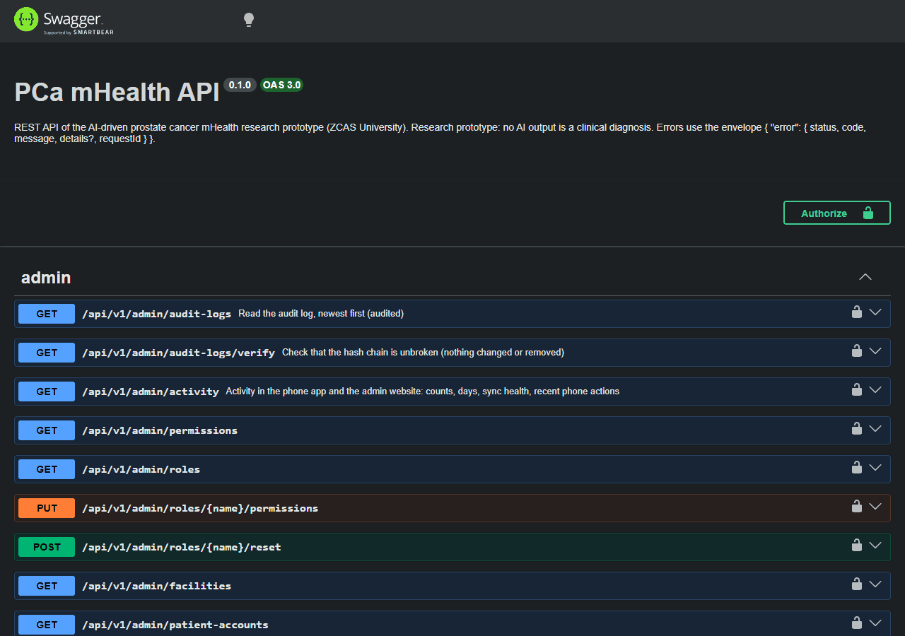

#### Figure 3.29: Entity-relationship diagram: all PostgreSQL tables and their keys

Generated from `schema.prisma`. Crow's-foot notation: a circle means "zero", a bar "one", a fork "many".

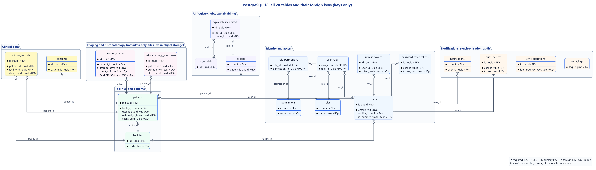

Files: [PNG](report/figures/erd-overview.png) · [SVG](report/figures/erd-overview.svg) · source generated: [erd-overview.puml](report/diagrams/generated/erd-overview.puml)

#### Figure 3.30: ERD: accounts, roles and sessions

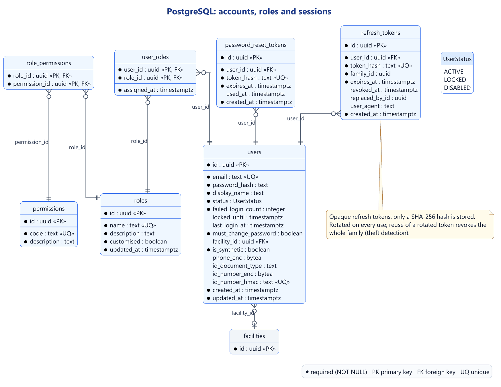

Files: [PNG](report/figures/erd-accounts.png) · [SVG](report/figures/erd-accounts.svg) · source generated: [erd-accounts.puml](report/diagrams/generated/erd-accounts.puml)

#### Figure 3.31: ERD: facilities, patients, screenings, consent, scans and slides

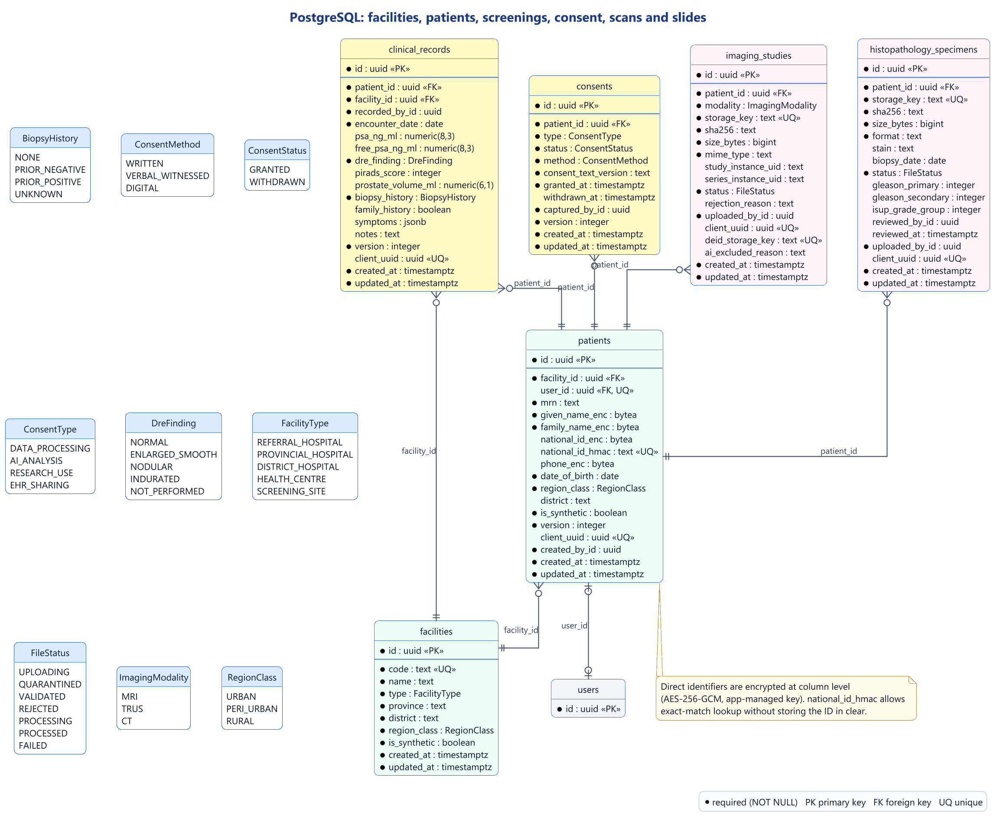

Files: [PNG](report/figures/erd-patients.png) · [SVG](report/figures/erd-patients.svg) · source generated: [erd-patients.puml](report/diagrams/generated/erd-patients.puml)

#### Figure 3.32: ERD: AI jobs, notifications, synchronisation and the audit log

Also the phones that receive push notifications (`push_devices`, ADR-014), and when each notification was pushed (`notifications.pushed_at`).

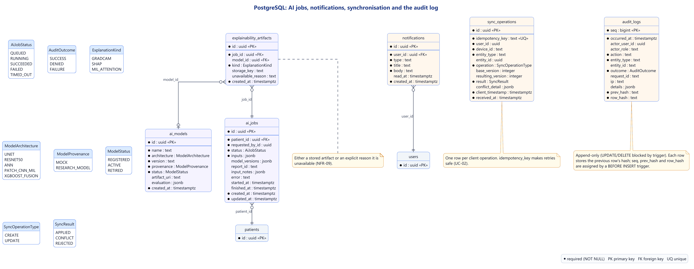

Files: [PNG](report/figures/erd-ai-sync-audit.png) · [SVG](report/figures/erd-ai-sync-audit.svg) · source generated: [erd-ai-sync-audit.puml](report/diagrams/generated/erd-ai-sync-audit.puml)

#### Figure 3.33: MongoDB: the four document collections and their rules

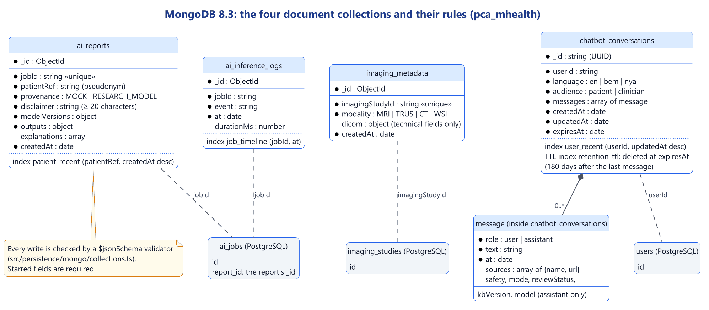

Files: [PNG](report/figures/database-mongodb.png) · [SVG](report/figures/database-mongodb.svg) · source [database-mongodb.puml](report/diagrams/database-mongodb.puml)

#### Figure 3.34: The phone's encrypted database

The six tables the app keeps on the phone (Drift with SQLCipher) for offline work.

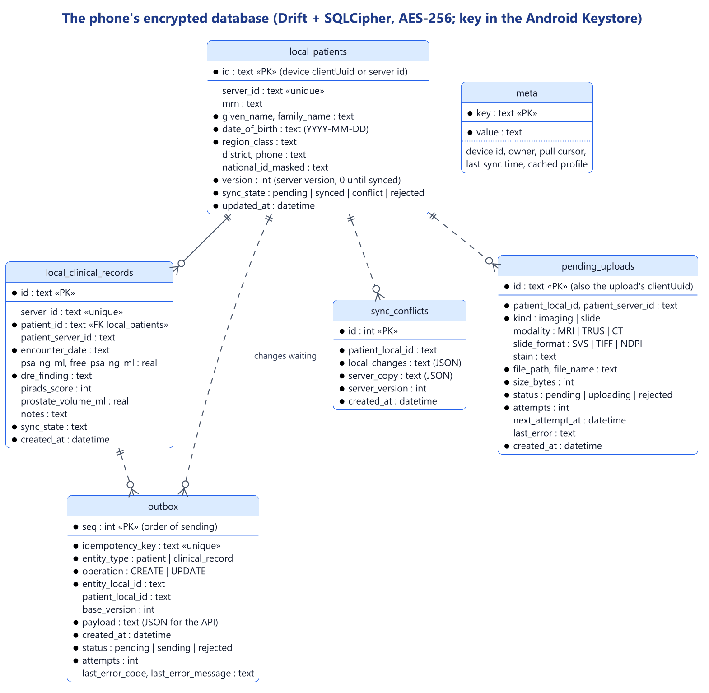

Files: [PNG](report/figures/database-phone.png) · [SVG](report/figures/database-phone.svg) · source [database-phone.puml](report/diagrams/database-phone.puml)

#### Facts for the normalisation section

These are facts about the schema you can use when you discuss normalisation:

- **Keys:** every table has a primary key: a UUID `id`, except the two link tables `user_roles` (`user_id`, `role_id`) and `role_permissions` (`role_id`, `permission_id`), which have composite keys, and `audit_logs`, keyed by a sequence number `seq`.
- **Alternate keys** (unique columns): for example `users.email`, and `push_devices.token`, so one phone is registered only once.
- **Many-to-many relations** (users and roles, roles and permissions) are resolved by those two link tables.
- **Second normal form:** the only composite keys are those of the link tables; `role_permissions` has no other column, and `user_roles.assigned_at` depends on the whole key.
- **Third normal form:** facility details are stored once in `facilities` and referenced by `facility_id`; role names once in `roles`. PSA density and the free-to-total PSA ratio are calculated when a record is read, not stored.
- **Deliberate exceptions:**
  - Some columns hold a JSON value: `clinical_records.symptoms`, `ai_jobs.inputs`, `model_versions` and `input_notes`, `ai_models.evaluation`, `sync_operations.conflict_detail`, `audit_logs.details`.
  - `histopathology_specimens.isup_grade_group` is computed by the server from the two Gleason values and stored with the review.
  - AI reports, chats and scan details live in MongoDB as documents, linked by id.
- **Integrity rules in the database:** 18 foreign keys, unique keys, CHECK constraints on clinical values (PSA, PI-RADS, Gleason, ISUP), and triggers that make `audit_logs` append-only and chain each row's hash to the previous one.

#### Figure 3.35: The app's screens and navigation

Every route of the app and how people move between screens, by role.

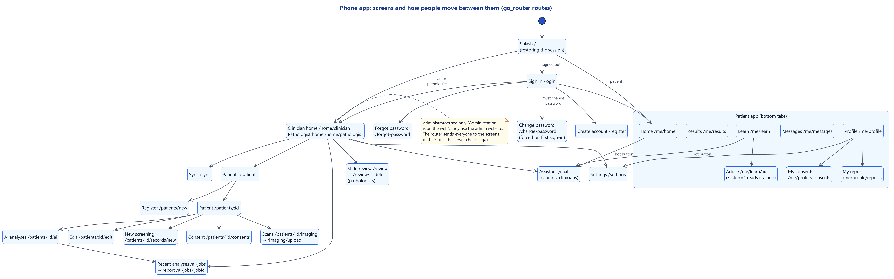

Files: [PNG](report/figures/navigation-app.png) · [SVG](report/figures/navigation-app.svg) · source [navigation-app.puml](report/diagrams/navigation-app.puml)

#### Figure 3.36: Interface design: patient screens

| Sign-in | Patient home (emulator) | Learn (dark mode) | An article read aloud (emulator) |
|---|---|---|---|
| 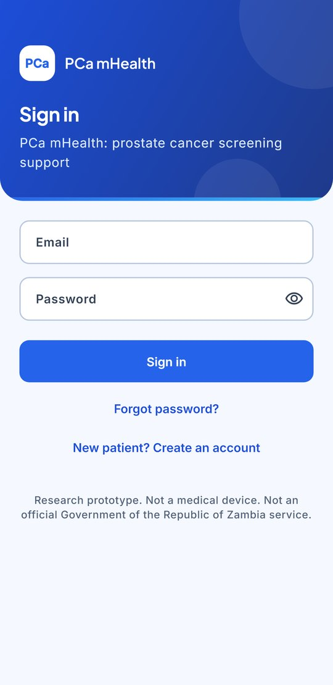 | 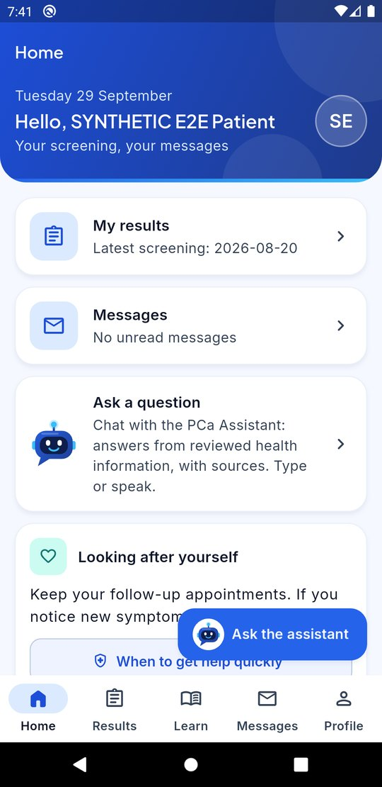 | 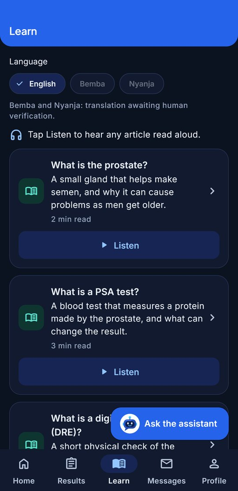 | 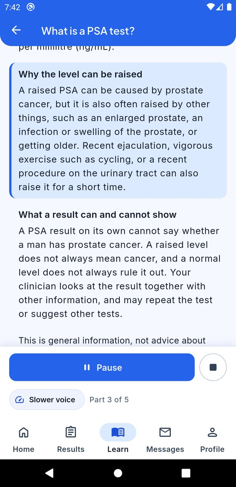 |

#### Figure 3.37: Interface design: the assistant

| Empty chat | An answer with its sources | Casual chat |
|---|---|---|
| 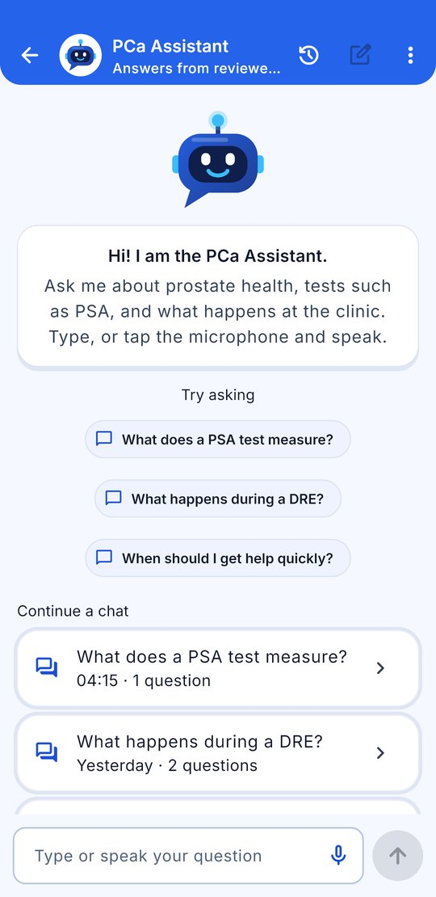 | 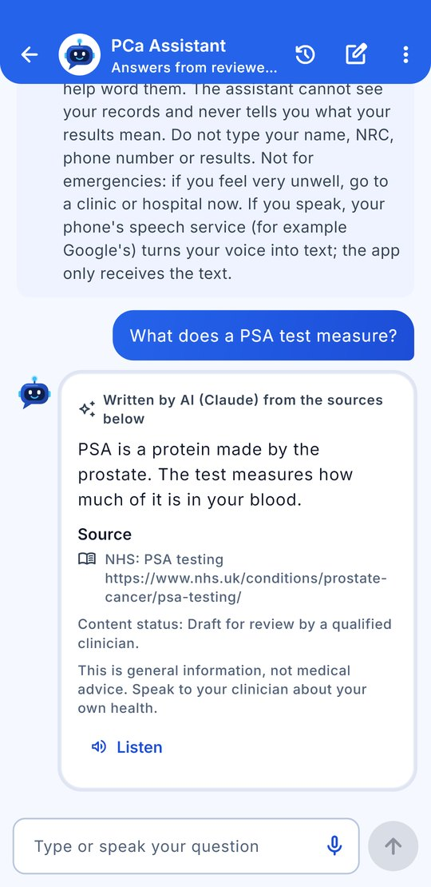 | 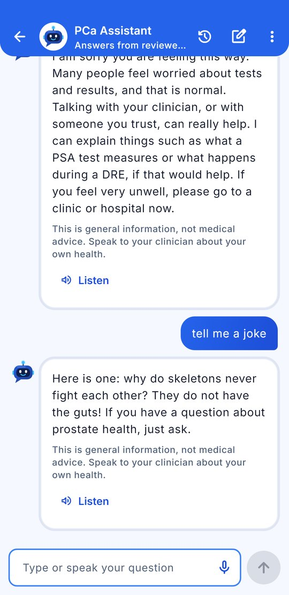 |

| Past chats | Speaking a question |
|---|---|
| 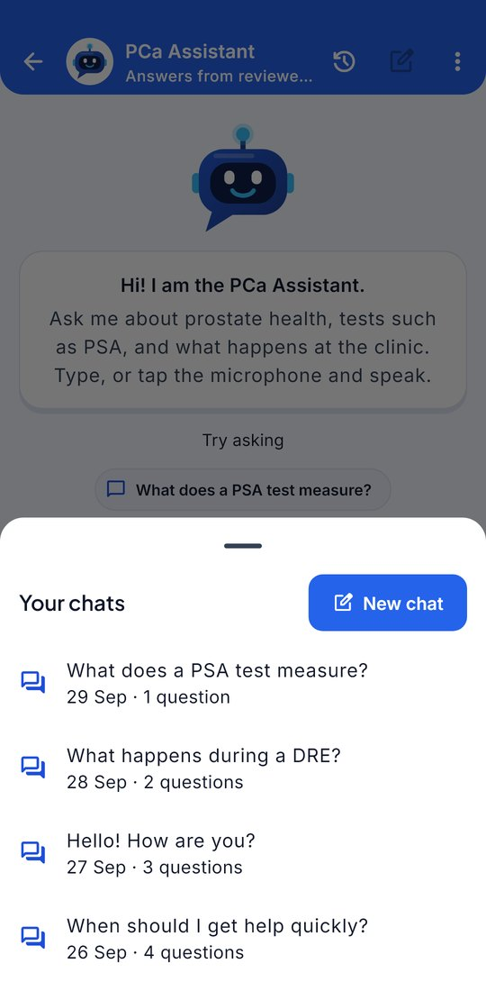 | 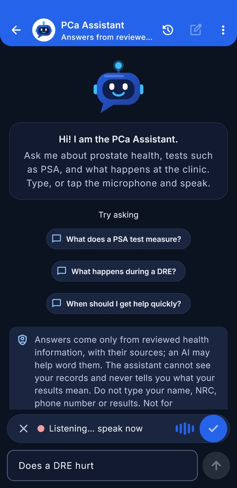 |

The answer is the AI service's real answer to that question; the casual replies are the backend's real replies; in the recording picture a stand-in plays the part of the phone's speech service.

#### Figure 3.38: Interface design: clinician home

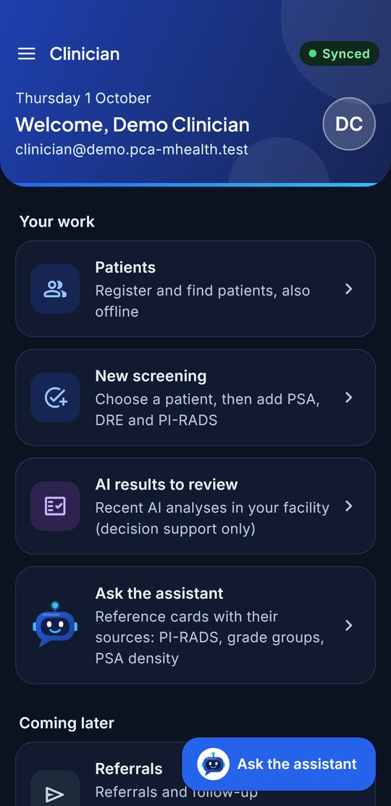

#### Figure 3.39: Interface design: the admin website

The dashboard, the accounts list and the delete dialog. Synthetic API answers were used for these pictures; the dashboard's numbers are made up for the picture.

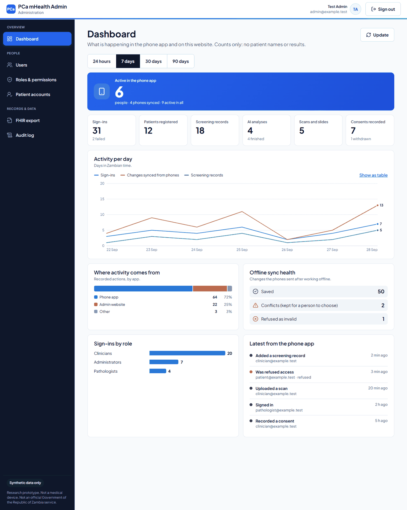

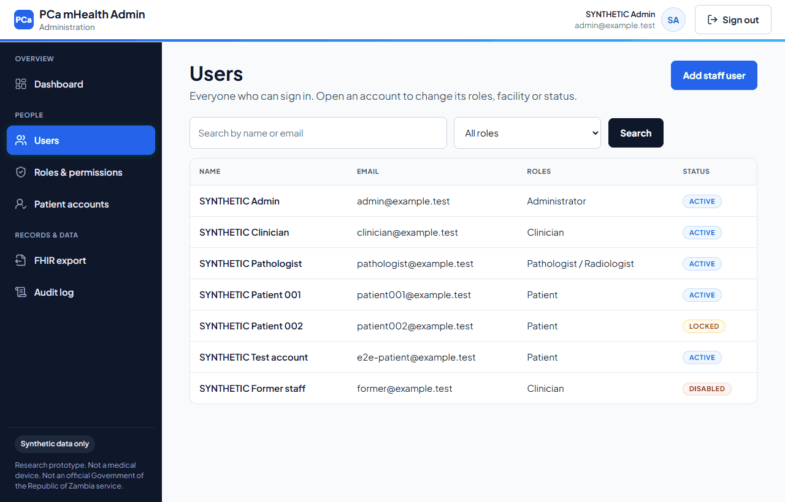

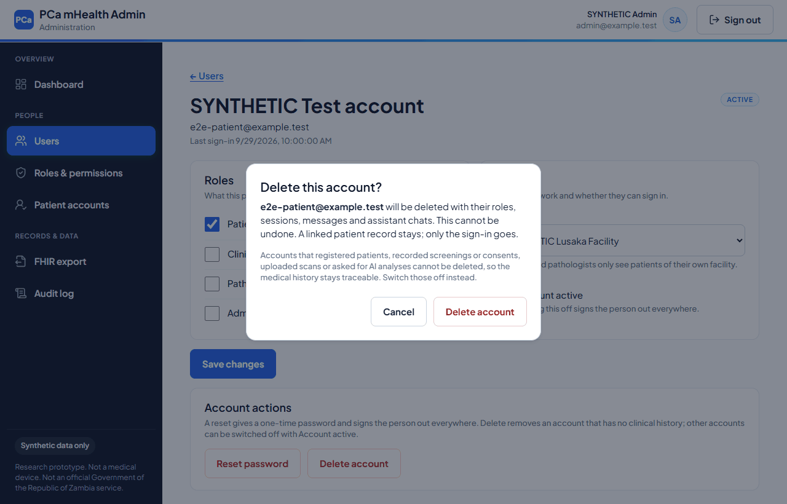

---

## Chapter 4: System implementation and testing

### 4.1 System guide and 4.2 Installation manual

The [operations manual](operations-manual.md) is the system guide and installation manual: what is installed, how to start, check and stop everything (§2 to §4), the phone app (§10) and the admin website (§11). [how-to-test.md](how-to-test.md) walks through every feature by hand. Figure 3.22 (deployment) shows where each part runs.

### 4.3 Testing plan and test output

#### Figure 4.1: The quality gate

What runs before every commit and in CI: formatting, lint, types, tests with at least 80 % coverage, builds and security audits, for each part.


Files: [PNG](report/figures/activity-quality-gate.png) · [SVG](report/figures/activity-quality-gate.svg) · source [activity-quality-gate.puml](report/diagrams/activity-quality-gate.puml)

#### Figure 4.2: Test output: the backend gate

The real output of the backend gate (summary lines). The testing strategy is in [testing-strategy.md](testing-strategy.md); the counts for every part are in §12 of the operations manual.


**The user acceptance test** (proposal §3.8.2) has its own kit in [uat/](uat/README.md): the plan, the information sheet and consent form, task sheets for each role, the SUS questionnaire and a results template whose tables fit this section. It may only be used after ethics approval.

### 4.4 Main function codes

The code that meets each objective of the proposal. Every picture shows the real file with its line numbers.

**Objective 1: a secure, offline-first mobile application (AES-256, TLS 1.3, RBAC, FHIR R4)**

#### Figure 4.3: The phone's encrypted database (SQLCipher key in the Keystore)


#### Figure 4.4: The phone's sync engine


#### Figure 4.5: The server applies each synced change once (idempotency)


#### Figure 4.6: AES-256-GCM encryption of identifiers, and HMAC look-ups


#### Figure 4.7: Sign-in with lockout and session tokens


#### Figure 4.8: Role-based access control: the permissions guard


#### Figure 4.9: TLS 1.3 only at the reverse proxy


#### Figure 4.10: Safe Harbor de-identification rules for the FHIR export


#### Figure 4.11: Push notifications: the outbox sends each new notification once (ADR-014)


**Objective 2: the multi-modal AI inference engine** (the pipeline is built; the trained models are not, so the modules are labelled mocks)

#### Figure 4.12: Requesting an analysis: consent first


#### Figure 4.13: The model router and the fusion step


#### Figure 4.14: Fairness check across groups (AUC gap above 0.05 flagged)


**Objective 3: the patient education chatbot**

#### Figure 4.15: Safety rules, checked before every answer


#### Figure 4.16: The chatbot service: safety, small talk, then the knowledge base


#### Figure 4.17: Retrieval, step 1: BM25 keyword search of the reviewed knowledge base


#### Figure 4.18: Retrieval, step 2: the keywords decide, MedCPT chooses the article (ADR-013)


#### Figure 4.19: The MedCPT encoder (PubMedBERT, 12 layers) written with numpy


#### Figure 4.20: Writing the answer from the passages


#### Figure 4.21: The app's chat controller


#### Figure 4.22: Voice input with the phone's speech service


#### Figure 4.23: Reading aloud for people who cannot read


**Objective 5: ethics, privacy and compliance**

#### Figure 4.24: The audit log's hash chain (database trigger)


Figures 4.6 (encryption), 4.10 (de-identification) and 4.14 (fairness) also belong to this objective. **Objective 4** (data collection and model training) has no code yet: no training data or trained model exists in the prototype.

**More code pictures** in [report/img](report/img), for example the small-talk replies (`code-chat-small-talk.png`), the knowledge base (`code-ai-knowledge-base.png`), the assistant's face drawn in code (`code-app-bot-painter.png`), the user model (`code-backend-prisma-user.png`) and the admin delete dialog (`code-admin-delete-dialog.png`).
